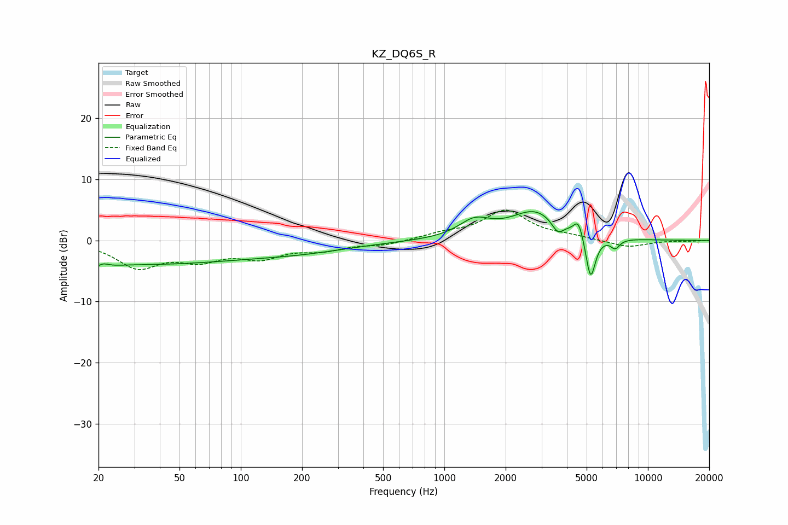

# KZ_DQ6S_R
See [usage instructions](https://github.com/jaakkopasanen/AutoEq#usage) for more options and info.

### Parametric EQs
Apply preamp of -4.8 dB when using parametric equalizer.

|   # | Type    |   Fc (Hz) |    Q |   Gain (dB) |
|-----|---------|-----------|------|-------------|
|   1 | Peaking |        20 | 2.96 |        -3.8 |
|   2 | Peaking |        21 | 3.8  |         3.2 |
|   3 | Peaking |        33 | 0.27 |        -3.7 |
|   4 | Peaking |       206 | 0.56 |        -1.3 |
|   5 | Peaking |      1407 | 1.81 |         2.7 |
|   6 | Peaking |      2800 | 1.14 |         4.7 |
|   7 | Peaking |      3600 | 4.89 |        -2   |
|   8 | Peaking |      4567 | 5.98 |         2.8 |
|   9 | Peaking |      5228 | 5.73 |        -7.5 |
|  10 | Peaking |      6904 | 5.96 |        -1.5 |

### Fixed Band EQs
When using fixed band (also called graphic) equalizer, apply preamp of **-5.1 dB** (if available) and set gains manually with these parameters.

|   # | Type    |   Fc (Hz) |    Q |   Gain (dB) |
|-----|---------|-----------|------|-------------|
|   1 | Peaking |        31 | 1.41 |        -4.2 |
|   2 | Peaking |        62 | 1.41 |        -2.7 |
|   3 | Peaking |       125 | 1.41 |        -2.5 |
|   4 | Peaking |       250 | 1.41 |        -1.3 |
|   5 | Peaking |       500 | 1.41 |        -0.7 |
|   6 | Peaking |      1000 | 1.41 |         1   |
|   7 | Peaking |      2000 | 1.41 |         4.8 |
|   8 | Peaking |      4000 | 1.41 |         0.5 |
|   9 | Peaking |      8000 | 1.41 |        -1.1 |
|  10 | Peaking |     16000 | 1.41 |        -0.1 |

### Graphs

