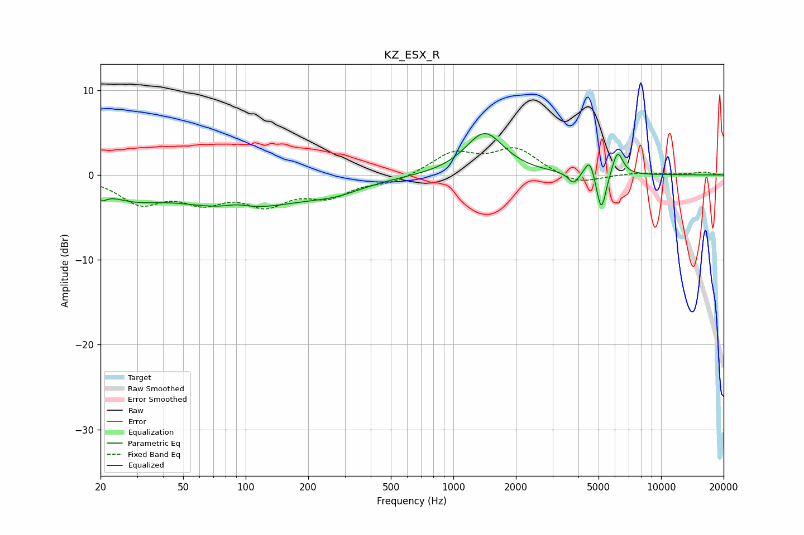

# KZ_ESX_R
See [usage instructions](https://github.com/jaakkopasanen/AutoEq#usage) for more options and info.

### Parametric EQs
Apply preamp of -5.0 dB when using parametric equalizer.

|   # | Type    |   Fc (Hz) |    Q |   Gain (dB) |
|-----|---------|-----------|------|-------------|
|   1 | Peaking |        20 | 5.65 |        -1.1 |
|   2 | Peaking |        28 | 1.05 |        -1.8 |
|   3 | Peaking |        90 | 2.33 |         0.5 |
|   4 | Peaking |        94 | 0.45 |        -3.8 |
|   5 | Peaking |       273 | 1.05 |        -1   |
|   6 | Peaking |      1414 | 1.53 |         5   |
|   7 | Peaking |      3789 | 5.58 |        -1.3 |
|   8 | Peaking |      4538 | 5.98 |         2.2 |
|   9 | Peaking |      5154 | 6    |        -4.8 |
|  10 | Peaking |      6169 | 5.28 |         2.9 |

### Fixed Band EQs
When using fixed band (also called graphic) equalizer, apply preamp of **-3.3 dB** (if available) and set gains manually with these parameters.

|   # | Type    |   Fc (Hz) |    Q |   Gain (dB) |
|-----|---------|-----------|------|-------------|
|   1 | Peaking |        31 | 1.41 |        -3.1 |
|   2 | Peaking |        62 | 1.41 |        -2.6 |
|   3 | Peaking |       125 | 1.41 |        -3   |
|   4 | Peaking |       250 | 1.41 |        -2.2 |
|   5 | Peaking |       500 | 1.41 |        -0.9 |
|   6 | Peaking |      1000 | 1.41 |         2.5 |
|   7 | Peaking |      2000 | 1.41 |         3   |
|   8 | Peaking |      4000 | 1.41 |        -1.2 |
|   9 | Peaking |      8000 | 1.41 |         0.3 |
|  10 | Peaking |     16000 | 1.41 |         0.3 |

### Graphs

