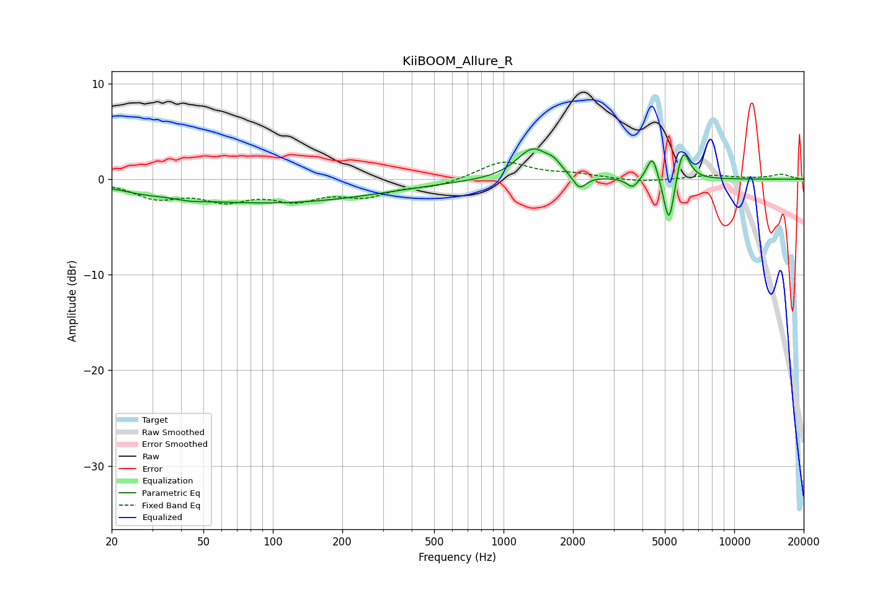

# KiiBOOM_Allure_R
See [usage instructions](https://github.com/jaakkopasanen/AutoEq#usage) for more options and info.

### Parametric EQs
Apply preamp of -3.3 dB when using parametric equalizer.

|   # | Type    |   Fc (Hz) |    Q |   Gain (dB) |
|-----|---------|-----------|------|-------------|
|   1 | Peaking |        27 | 1.83 |        -0.3 |
|   2 | Peaking |        44 | 2.15 |        -0.3 |
|   3 | Peaking |        97 | 0.29 |        -2.5 |
|   4 | Peaking |      1340 | 2.02 |         3.2 |
|   5 | Peaking |      1652 | 4.62 |         0.7 |
|   6 | Peaking |      2135 | 4.94 |        -1.5 |
|   7 | Peaking |      3628 | 5.58 |        -1.1 |
|   8 | Peaking |      4422 | 5.91 |         2.7 |
|   9 | Peaking |      5217 | 6    |        -5.4 |
|  10 | Peaking |      5987 | 4.81 |         3.6 |

### Fixed Band EQs
When using fixed band (also called graphic) equalizer, apply preamp of **-1.9 dB** (if available) and set gains manually with these parameters.

|   # | Type    |   Fc (Hz) |    Q |   Gain (dB) |
|-----|---------|-----------|------|-------------|
|   1 | Peaking |        31 | 1.41 |        -1.8 |
|   2 | Peaking |        62 | 1.41 |        -1.9 |
|   3 | Peaking |       125 | 1.41 |        -1.8 |
|   4 | Peaking |       250 | 1.41 |        -1.5 |
|   5 | Peaking |       500 | 1.41 |        -0.7 |
|   6 | Peaking |      1000 | 1.41 |         1.9 |
|   7 | Peaking |      2000 | 1.41 |         0.5 |
|   8 | Peaking |      4000 | 1.41 |        -0.3 |
|   9 | Peaking |      8000 | 1.41 |         0.4 |
|  10 | Peaking |     16000 | 1.41 |         0.5 |

### Graphs

