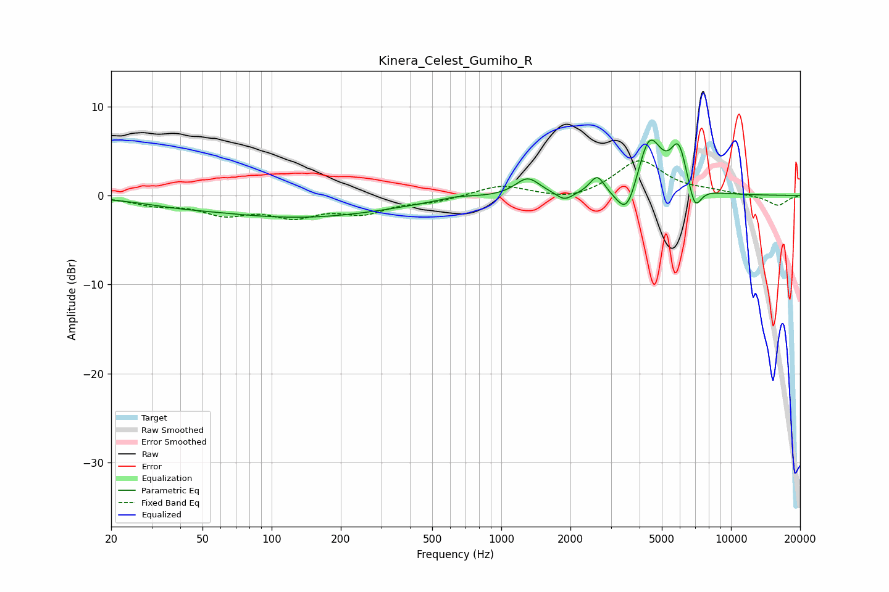

# Kinera_Celest_Gumiho_R
See [usage instructions](https://github.com/jaakkopasanen/AutoEq#usage) for more options and info.

### Parametric EQs
Apply preamp of -6.3 dB when using parametric equalizer.

|   # | Type    |   Fc (Hz) |    Q |   Gain (dB) |
|-----|---------|-----------|------|-------------|
|   1 | Peaking |        38 | 0.99 |        -0.4 |
|   2 | Peaking |       133 | 0.35 |        -2.4 |
|   3 | Peaking |       635 | 1.8  |         0.4 |
|   4 | Peaking |      1303 | 2.67 |         2   |
|   5 | Peaking |      1884 | 4.05 |        -0.9 |
|   6 | Peaking |      2616 | 4.48 |         2.1 |
|   7 | Peaking |      3531 | 3.07 |        -4   |
|   8 | Peaking |      4401 | 2.57 |         6.8 |
|   9 | Peaking |      5922 | 3.88 |         4.8 |
|  10 | Peaking |      6958 | 4.9  |        -3   |

### Fixed Band EQs
When using fixed band (also called graphic) equalizer, apply preamp of **-4.0 dB** (if available) and set gains manually with these parameters.

|   # | Type    |   Fc (Hz) |    Q |   Gain (dB) |
|-----|---------|-----------|------|-------------|
|   1 | Peaking |        31 | 1.41 |        -0.9 |
|   2 | Peaking |        62 | 1.41 |        -1.8 |
|   3 | Peaking |       125 | 1.41 |        -2   |
|   4 | Peaking |       250 | 1.41 |        -1.7 |
|   5 | Peaking |       500 | 1.41 |        -0.6 |
|   6 | Peaking |      1000 | 1.41 |         1.2 |
|   7 | Peaking |      2000 | 1.41 |        -0.7 |
|   8 | Peaking |      4000 | 1.41 |         3.9 |
|   9 | Peaking |      8000 | 1.41 |         0.4 |
|  10 | Peaking |     16000 | 1.41 |        -1.1 |

### Graphs

