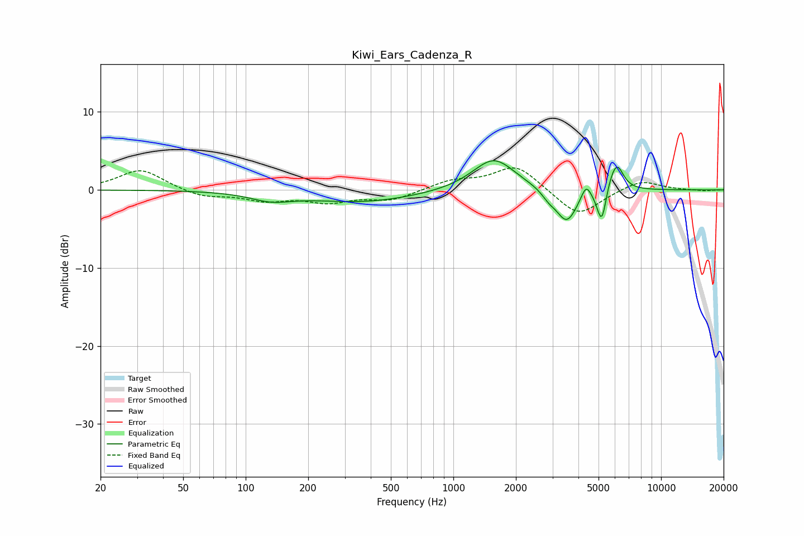

# Kiwi_Ears_Cadenza_R
See [usage instructions](https://github.com/jaakkopasanen/AutoEq#usage) for more options and info.

### Parametric EQs
Apply preamp of -3.8 dB when using parametric equalizer.

|   # | Type    |   Fc (Hz) |    Q |   Gain (dB) |
|-----|---------|-----------|------|-------------|
|   1 | Peaking |       133 | 1.43 |        -1   |
|   2 | Peaking |       367 | 0.54 |        -1.5 |
|   3 | Peaking |      1565 | 1.38 |         4.2 |
|   4 | Peaking |      2880 | 4.24 |        -0.8 |
|   5 | Peaking |      3513 | 2.76 |        -4.3 |
|   6 | Peaking |      4354 | 6    |         1.8 |
|   7 | Peaking |      5150 | 6    |        -1.2 |
|   8 | Peaking |      5196 | 5.99 |        -3.8 |
|   9 | Peaking |      5657 | 3.82 |         1.5 |
|  10 | Peaking |      6152 | 4.47 |         2.9 |

### Fixed Band EQs
When using fixed band (also called graphic) equalizer, apply preamp of **-2.9 dB** (if available) and set gains manually with these parameters.

|   # | Type    |   Fc (Hz) |    Q |   Gain (dB) |
|-----|---------|-----------|------|-------------|
|   1 | Peaking |        31 | 1.41 |         2.7 |
|   2 | Peaking |        62 | 1.41 |        -0.9 |
|   3 | Peaking |       125 | 1.41 |        -1.2 |
|   4 | Peaking |       250 | 1.41 |        -1.4 |
|   5 | Peaking |       500 | 1.41 |        -1.2 |
|   6 | Peaking |      1000 | 1.41 |         1.1 |
|   7 | Peaking |      2000 | 1.41 |         3.2 |
|   8 | Peaking |      4000 | 1.41 |        -3.5 |
|   9 | Peaking |      8000 | 1.41 |         1.3 |
|  10 | Peaking |     16000 | 1.41 |        -0.1 |

### Graphs

