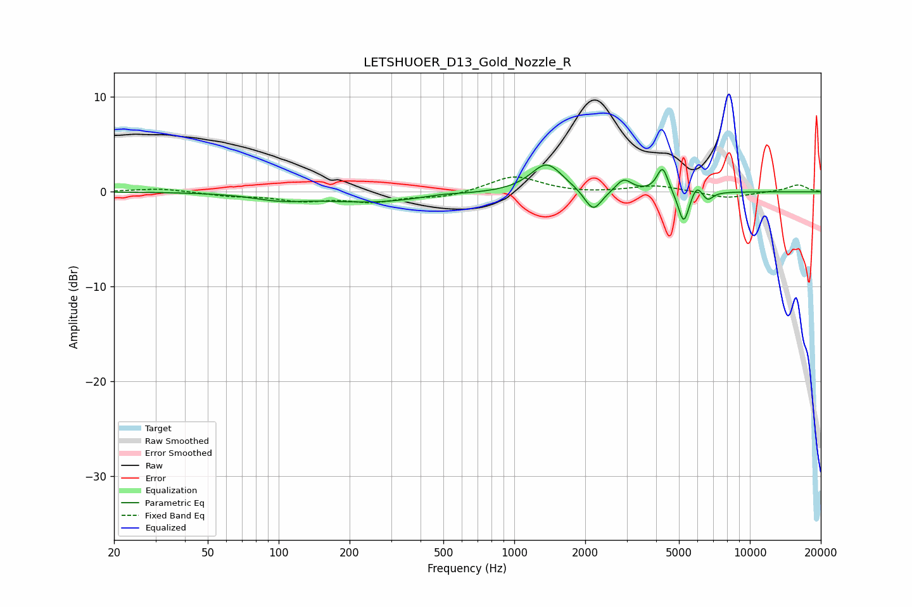

# LETSHUOER_D13_Gold_Nozzle_R
See [usage instructions](https://github.com/jaakkopasanen/AutoEq#usage) for more options and info.

### Parametric EQs
Apply preamp of -2.9 dB when using parametric equalizer.

|   # | Type    |   Fc (Hz) |    Q |   Gain (dB) |
|-----|---------|-----------|------|-------------|
|   1 | Peaking |       100 | 1.29 |        -0.6 |
|   2 | Peaking |       252 | 0.62 |        -1   |
|   3 | Peaking |       490 | 1.86 |         0.2 |
|   4 | Peaking |      1373 | 2.12 |         3   |
|   5 | Peaking |      2163 | 3.81 |        -2.4 |
|   6 | Peaking |      2914 | 4.29 |         1.3 |
|   7 | Peaking |      4260 | 6    |         2.7 |
|   8 | Peaking |      5238 | 6    |        -3.5 |
|   9 | Peaking |      5949 | 6    |         1.2 |
|  10 | Peaking |      6615 | 6    |        -0.9 |

### Fixed Band EQs
When using fixed band (also called graphic) equalizer, apply preamp of **-1.7 dB** (if available) and set gains manually with these parameters.

|   # | Type    |   Fc (Hz) |    Q |   Gain (dB) |
|-----|---------|-----------|------|-------------|
|   1 | Peaking |        31 | 1.41 |         0.4 |
|   2 | Peaking |        62 | 1.41 |        -0.4 |
|   3 | Peaking |       125 | 1.41 |        -0.8 |
|   4 | Peaking |       250 | 1.41 |        -0.9 |
|   5 | Peaking |       500 | 1.41 |        -0.6 |
|   6 | Peaking |      1000 | 1.41 |         1.7 |
|   7 | Peaking |      2000 | 1.41 |        -0.2 |
|   8 | Peaking |      4000 | 1.41 |         0.7 |
|   9 | Peaking |      8000 | 1.41 |        -0.7 |
|  10 | Peaking |     16000 | 1.41 |         0.8 |

### Graphs

