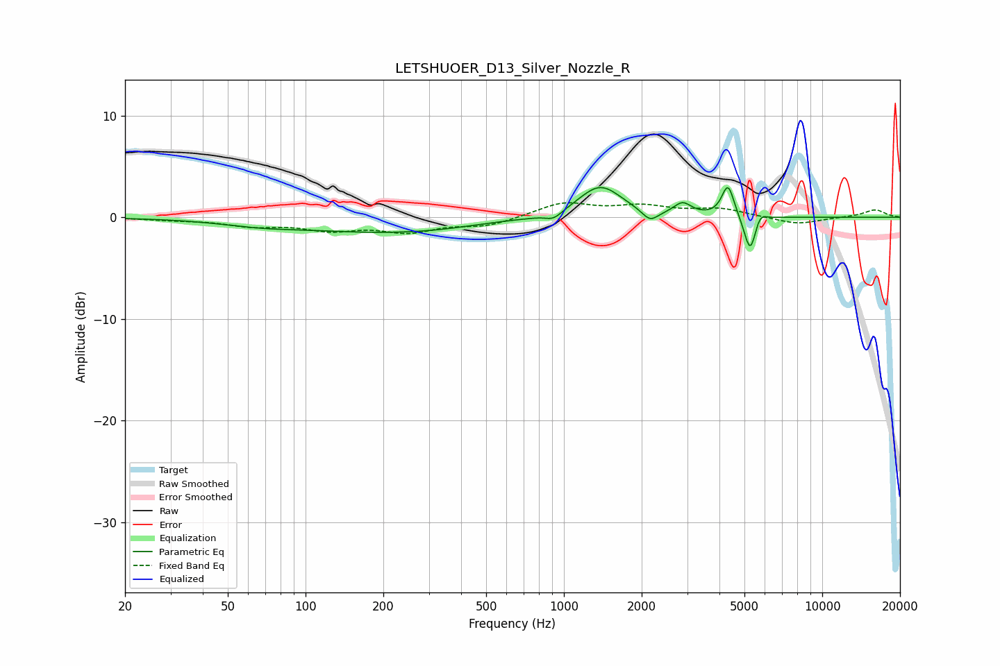

# LETSHUOER_D13_Silver_Nozzle_R
See [usage instructions](https://github.com/jaakkopasanen/AutoEq#usage) for more options and info.

### Parametric EQs
Apply preamp of -3.0 dB when using parametric equalizer.

|   # | Type    |   Fc (Hz) |    Q |   Gain (dB) |
|-----|---------|-----------|------|-------------|
|   1 | Peaking |        66 | 0.94 |        -0.4 |
|   2 | Peaking |       230 | 0.37 |        -1.5 |
|   3 | Peaking |       521 | 1.04 |         0.3 |
|   4 | Peaking |       913 | 4.4  |        -0.7 |
|   5 | Peaking |      1381 | 1.67 |         3.2 |
|   6 | Peaking |      2156 | 4.47 |        -1.1 |
|   7 | Peaking |      2881 | 4.22 |         1.2 |
|   8 | Peaking |      4317 | 5.98 |         3.2 |
|   9 | Peaking |      5266 | 6    |        -3.9 |
|  10 | Peaking |      5714 | 6    |         1.1 |

### Fixed Band EQs
When using fixed band (also called graphic) equalizer, apply preamp of **-1.5 dB** (if available) and set gains manually with these parameters.

|   # | Type    |   Fc (Hz) |    Q |   Gain (dB) |
|-----|---------|-----------|------|-------------|
|   1 | Peaking |        31 | 1.41 |        -0.2 |
|   2 | Peaking |        62 | 1.41 |        -0.7 |
|   3 | Peaking |       125 | 1.41 |        -1.1 |
|   4 | Peaking |       250 | 1.41 |        -1.3 |
|   5 | Peaking |       500 | 1.41 |        -0.8 |
|   6 | Peaking |      1000 | 1.41 |         1.4 |
|   7 | Peaking |      2000 | 1.41 |         1   |
|   8 | Peaking |      4000 | 1.41 |         0.8 |
|   9 | Peaking |      8000 | 1.41 |        -0.7 |
|  10 | Peaking |     16000 | 1.41 |         0.8 |

### Graphs

