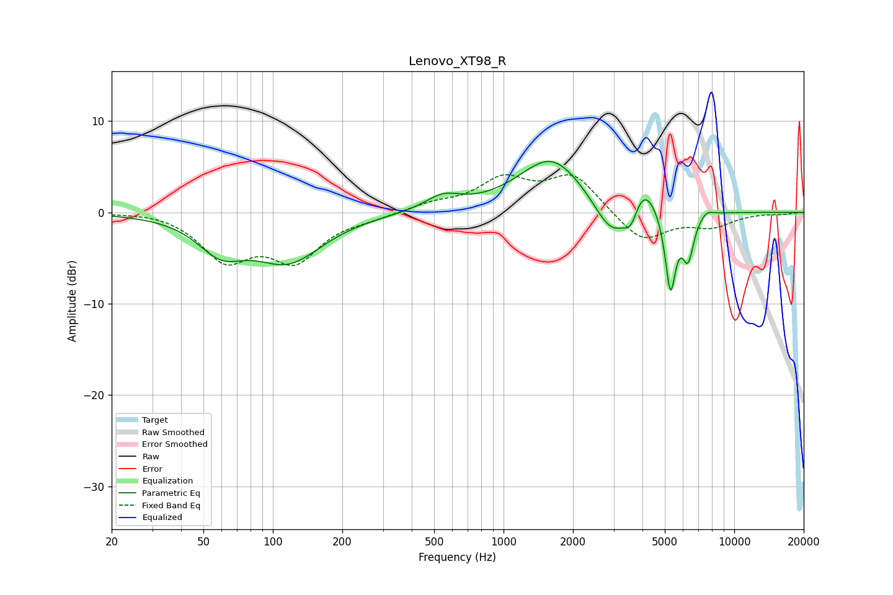

# Lenovo_XT98_R
See [usage instructions](https://github.com/jaakkopasanen/AutoEq#usage) for more options and info.

### Parametric EQs
Apply preamp of -5.7 dB when using parametric equalizer.

|   # | Type    |   Fc (Hz) |    Q |   Gain (dB) |
|-----|---------|-----------|------|-------------|
|   1 | Peaking |        59 | 1.42 |        -3.4 |
|   2 | Peaking |       116 | 0.93 |        -5.1 |
|   3 | Peaking |       545 | 1.84 |         1.6 |
|   4 | Peaking |      1618 | 0.98 |         6.1 |
|   5 | Peaking |      2940 | 1.87 |        -4.3 |
|   6 | Peaking |      3568 | 4.43 |        -2.5 |
|   7 | Peaking |      4016 | 2.35 |         3.8 |
|   8 | Peaking |      5290 | 5.95 |        -8.9 |
|   9 | Peaking |      6304 | 5.52 |        -4.7 |
|  10 | Peaking |      7596 | 4.88 |         0.6 |

### Fixed Band EQs
When using fixed band (also called graphic) equalizer, apply preamp of **-4.2 dB** (if available) and set gains manually with these parameters.

|   # | Type    |   Fc (Hz) |    Q |   Gain (dB) |
|-----|---------|-----------|------|-------------|
|   1 | Peaking |        31 | 1.41 |         0.3 |
|   2 | Peaking |        62 | 1.41 |        -4.9 |
|   3 | Peaking |       125 | 1.41 |        -4.9 |
|   4 | Peaking |       250 | 1.41 |        -0.5 |
|   5 | Peaking |       500 | 1.41 |         0.9 |
|   6 | Peaking |      1000 | 1.41 |         3.4 |
|   7 | Peaking |      2000 | 1.41 |         4   |
|   8 | Peaking |      4000 | 1.41 |        -3.3 |
|   9 | Peaking |      8000 | 1.41 |        -1.4 |
|  10 | Peaking |     16000 | 1.41 |        -0.2 |

### Graphs

