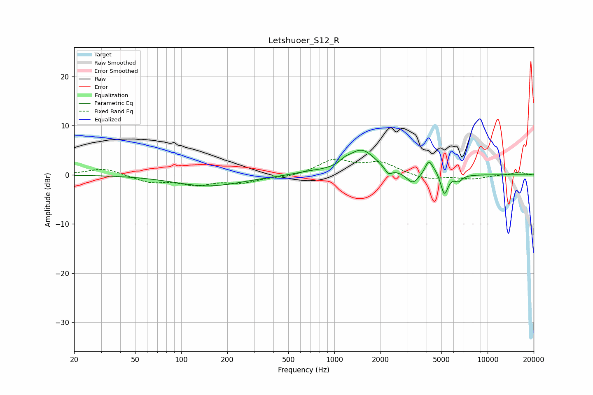

# Letshuoer_S12_R
See [usage instructions](https://github.com/jaakkopasanen/AutoEq#usage) for more options and info.

### Parametric EQs
Apply preamp of -5.1 dB when using parametric equalizer.

|   # | Type    |   Fc (Hz) |    Q |   Gain (dB) |
|-----|---------|-----------|------|-------------|
|   1 | Peaking |       151 | 0.64 |        -2.3 |
|   2 | Peaking |       680 | 1.45 |         0.4 |
|   3 | Peaking |      1174 | 4.55 |         0.6 |
|   4 | Peaking |      1504 | 1.53 |         5   |
|   5 | Peaking |      2250 | 6    |        -1.4 |
|   6 | Peaking |      3245 | 3.58 |        -2.3 |
|   7 | Peaking |      4129 | 5.77 |         2.8 |
|   8 | Peaking |      4582 | 4.54 |         0.9 |
|   9 | Peaking |      5222 | 6    |        -4.3 |
|  10 | Peaking |      6460 | 5.65 |        -1.1 |

### Fixed Band EQs
When using fixed band (also called graphic) equalizer, apply preamp of **-3.3 dB** (if available) and set gains manually with these parameters.

|   # | Type    |   Fc (Hz) |    Q |   Gain (dB) |
|-----|---------|-----------|------|-------------|
|   1 | Peaking |        31 | 1.41 |         1.4 |
|   2 | Peaking |        62 | 1.41 |        -1.4 |
|   3 | Peaking |       125 | 1.41 |        -1.8 |
|   4 | Peaking |       250 | 1.41 |        -1.4 |
|   5 | Peaking |       500 | 1.41 |        -0.4 |
|   6 | Peaking |      1000 | 1.41 |         2.9 |
|   7 | Peaking |      2000 | 1.41 |         2.3 |
|   8 | Peaking |      4000 | 1.41 |        -1   |
|   9 | Peaking |      8000 | 1.41 |        -0.8 |
|  10 | Peaking |     16000 | 1.41 |         0.6 |

### Graphs

