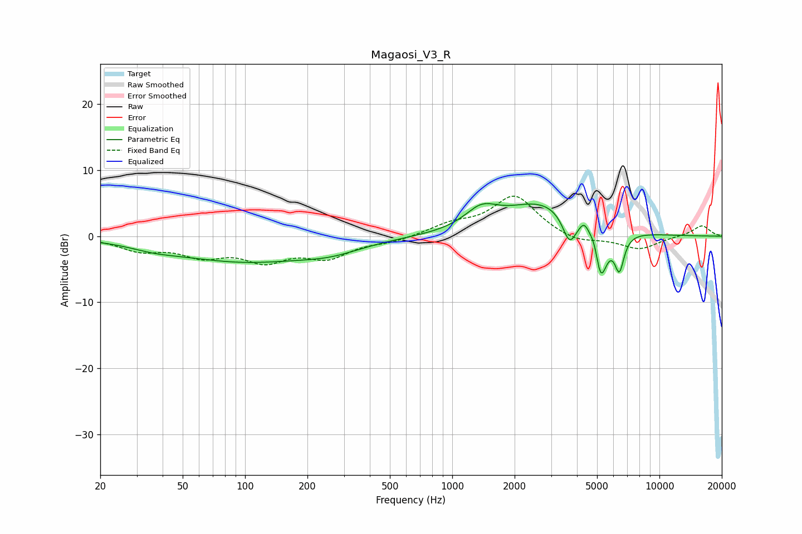

# Magaosi_V3_R
See [usage instructions](https://github.com/jaakkopasanen/AutoEq#usage) for more options and info.

### Parametric EQs
Apply preamp of -5.0 dB when using parametric equalizer.

|   # | Type    |   Fc (Hz) |    Q |   Gain (dB) |
|-----|---------|-----------|------|-------------|
|   1 | Peaking |        36 | 1.25 |        -0.7 |
|   2 | Peaking |        99 | 0.41 |        -3.7 |
|   3 | Peaking |       261 | 0.95 |        -1.3 |
|   4 | Peaking |      1382 | 1.8  |         2.9 |
|   5 | Peaking |      2734 | 0.77 |         5   |
|   6 | Peaking |      3680 | 4.25 |        -4.2 |
|   7 | Peaking |      4335 | 6    |         1.6 |
|   8 | Peaking |      4889 | 6    |         2.3 |
|   9 | Peaking |      5187 | 4.32 |        -8.4 |
|  10 | Peaking |      6407 | 6    |        -5.3 |

### Fixed Band EQs
When using fixed band (also called graphic) equalizer, apply preamp of **-6.2 dB** (if available) and set gains manually with these parameters.

|   # | Type    |   Fc (Hz) |    Q |   Gain (dB) |
|-----|---------|-----------|------|-------------|
|   1 | Peaking |        31 | 1.41 |        -1.9 |
|   2 | Peaking |        62 | 1.41 |        -2.6 |
|   3 | Peaking |       125 | 1.41 |        -3.3 |
|   4 | Peaking |       250 | 1.41 |        -2.9 |
|   5 | Peaking |       500 | 1.41 |        -0.7 |
|   6 | Peaking |      1000 | 1.41 |         1.6 |
|   7 | Peaking |      2000 | 1.41 |         6.1 |
|   8 | Peaking |      4000 | 1.41 |        -1.1 |
|   9 | Peaking |      8000 | 1.41 |        -2   |
|  10 | Peaking |     16000 | 1.41 |         1.7 |

### Graphs

