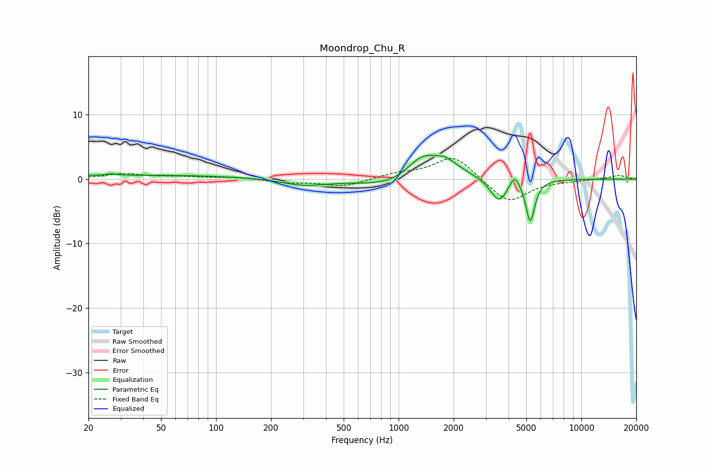

# Moondrop_Chu_R
See [usage instructions](https://github.com/jaakkopasanen/AutoEq#usage) for more options and info.

### Parametric EQs
Apply preamp of -3.8 dB when using parametric equalizer.

|   # | Type    |   Fc (Hz) |    Q |   Gain (dB) |
|-----|---------|-----------|------|-------------|
|   1 | Peaking |        27 | 5.84 |         0.2 |
|   2 | Peaking |        37 | 0.2  |         0.6 |
|   3 | Peaking |       301 | 1.2  |        -1   |
|   4 | Peaking |       999 | 0.73 |        -1.6 |
|   5 | Peaking |      1346 | 1.61 |         3.9 |
|   6 | Peaking |      1777 | 2.9  |         1   |
|   7 | Peaking |      1938 | 1.37 |         1.5 |
|   8 | Peaking |      3545 | 3.04 |        -3.6 |
|   9 | Peaking |      4320 | 5.2  |         2.1 |
|  10 | Peaking |      5256 | 5.71 |        -6.5 |

### Fixed Band EQs
When using fixed band (also called graphic) equalizer, apply preamp of **-3.3 dB** (if available) and set gains manually with these parameters.

|   # | Type    |   Fc (Hz) |    Q |   Gain (dB) |
|-----|---------|-----------|------|-------------|
|   1 | Peaking |        31 | 1.41 |         0.8 |
|   2 | Peaking |        62 | 1.41 |         0.3 |
|   3 | Peaking |       125 | 1.41 |         0.3 |
|   4 | Peaking |       250 | 1.41 |        -0.5 |
|   5 | Peaking |       500 | 1.41 |        -1.1 |
|   6 | Peaking |      1000 | 1.41 |         0.8 |
|   7 | Peaking |      2000 | 1.41 |         3.7 |
|   8 | Peaking |      4000 | 1.41 |        -3.8 |
|   9 | Peaking |      8000 | 1.41 |        -0.2 |
|  10 | Peaking |     16000 | 1.41 |         0.6 |

### Graphs

