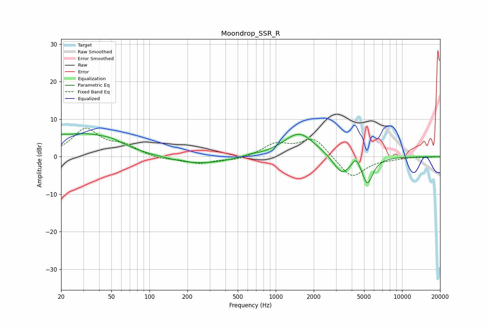

# Moondrop_SSR_R
See [usage instructions](https://github.com/jaakkopasanen/AutoEq#usage) for more options and info.

### Parametric EQs
Apply preamp of -6.2 dB when using parametric equalizer.

|   # | Type    |   Fc (Hz) |    Q |   Gain (dB) |
|-----|---------|-----------|------|-------------|
|   1 | Peaking |        20 | 6    |        -2.6 |
|   2 | Peaking |        20 | 5.75 |         3.2 |
|   3 | Peaking |        28 | 0.55 |         5.9 |
|   4 | Peaking |        50 | 1.54 |         1   |
|   5 | Peaking |       246 | 0.62 |        -2.1 |
|   6 | Peaking |       632 | 3.26 |         0.4 |
|   7 | Peaking |      1537 | 1.11 |         6.5 |
|   8 | Peaking |      3343 | 2.05 |        -5.1 |
|   9 | Peaking |      4326 | 4.32 |         2.8 |
|  10 | Peaking |      5311 | 3.17 |        -7.1 |

### Fixed Band EQs
When using fixed band (also called graphic) equalizer, apply preamp of **-7.7 dB** (if available) and set gains manually with these parameters.

|   # | Type    |   Fc (Hz) |    Q |   Gain (dB) |
|-----|---------|-----------|------|-------------|
|   1 | Peaking |        31 | 1.41 |         7.2 |
|   2 | Peaking |        62 | 1.41 |         2.6 |
|   3 | Peaking |       125 | 1.41 |        -0.8 |
|   4 | Peaking |       250 | 1.41 |        -1.8 |
|   5 | Peaking |       500 | 1.41 |        -0.9 |
|   6 | Peaking |      1000 | 1.41 |         3.2 |
|   7 | Peaking |      2000 | 1.41 |         5.1 |
|   8 | Peaking |      4000 | 1.41 |        -5.9 |
|   9 | Peaking |      8000 | 1.41 |        -0.4 |
|  10 | Peaking |     16000 | 1.41 |        -0.2 |

### Graphs

