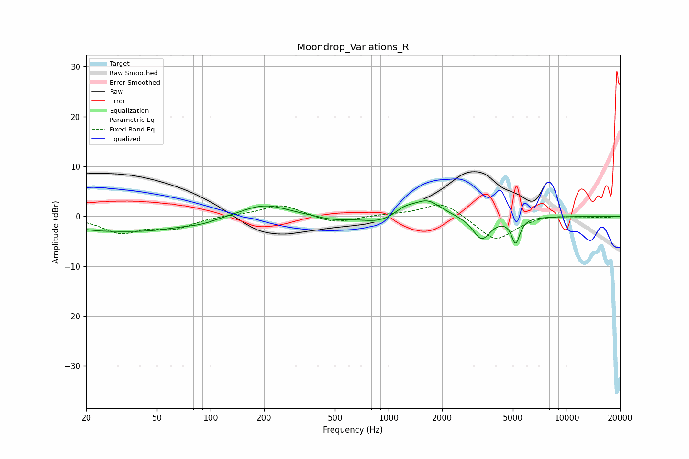

# Moondrop_Variations_R
See [usage instructions](https://github.com/jaakkopasanen/AutoEq#usage) for more options and info.

### Parametric EQs
Apply preamp of -3.2 dB when using parametric equalizer.

|   # | Type    |   Fc (Hz) |    Q |   Gain (dB) |
|-----|---------|-----------|------|-------------|
|   1 | Peaking |        22 | 0.77 |        -2   |
|   2 | Peaking |        46 | 0.73 |        -2.1 |
|   3 | Peaking |        88 | 1.51 |        -0.8 |
|   4 | Peaking |       200 | 1.1  |         2.5 |
|   5 | Peaking |       489 | 1.64 |        -0.7 |
|   6 | Peaking |       907 | 1.34 |        -1.5 |
|   7 | Peaking |      1225 | 2.39 |         1.6 |
|   8 | Peaking |      1654 | 1.82 |         3.2 |
|   9 | Peaking |      3335 | 2.86 |        -4.6 |
|  10 | Peaking |      5182 | 6    |        -5   |

### Fixed Band EQs
When using fixed band (also called graphic) equalizer, apply preamp of **-2.3 dB** (if available) and set gains manually with these parameters.

|   # | Type    |   Fc (Hz) |    Q |   Gain (dB) |
|-----|---------|-----------|------|-------------|
|   1 | Peaking |        31 | 1.41 |        -3.1 |
|   2 | Peaking |        62 | 1.41 |        -2.2 |
|   3 | Peaking |       125 | 1.41 |         0.2 |
|   4 | Peaking |       250 | 1.41 |         2.4 |
|   5 | Peaking |       500 | 1.41 |        -1.5 |
|   6 | Peaking |      1000 | 1.41 |         0.3 |
|   7 | Peaking |      2000 | 1.41 |         3   |
|   8 | Peaking |      4000 | 1.41 |        -5   |
|   9 | Peaking |      8000 | 1.41 |         0.4 |
|  10 | Peaking |     16000 | 1.41 |        -0.2 |

### Graphs

