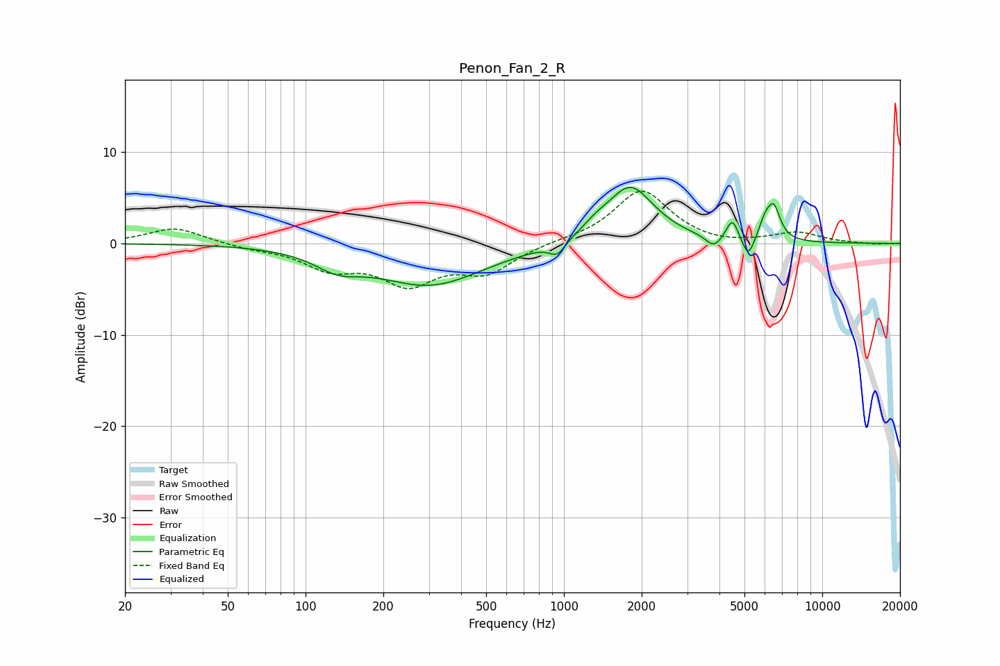

# Penon_Fan_2_R
See [usage instructions](https://github.com/jaakkopasanen/AutoEq#usage) for more options and info.

### Parametric EQs
Apply preamp of -6.2 dB when using parametric equalizer.

|   # | Type    |   Fc (Hz) |    Q |   Gain (dB) |
|-----|---------|-----------|------|-------------|
|   1 | Peaking |       133 | 1.61 |        -1.7 |
|   2 | Peaking |       302 | 0.67 |        -4.5 |
|   3 | Peaking |       944 | 4.58 |        -1.4 |
|   4 | Peaking |      1325 | 3.01 |         0.7 |
|   5 | Peaking |      1804 | 1.51 |         6.3 |
|   6 | Peaking |      3805 | 4.64 |        -1.3 |
|   7 | Peaking |      4488 | 6    |         2.4 |
|   8 | Peaking |      5170 | 6    |        -2.4 |
|   9 | Peaking |      6006 | 5.95 |         1.8 |
|  10 | Peaking |      6497 | 5.43 |         3.5 |

### Fixed Band EQs
When using fixed band (also called graphic) equalizer, apply preamp of **-5.8 dB** (if available) and set gains manually with these parameters.

|   # | Type    |   Fc (Hz) |    Q |   Gain (dB) |
|-----|---------|-----------|------|-------------|
|   1 | Peaking |        31 | 1.41 |         1.8 |
|   2 | Peaking |        62 | 1.41 |        -0.4 |
|   3 | Peaking |       125 | 1.41 |        -2.5 |
|   4 | Peaking |       250 | 1.41 |        -4   |
|   5 | Peaking |       500 | 1.41 |        -2.9 |
|   6 | Peaking |      1000 | 1.41 |         0.2 |
|   7 | Peaking |      2000 | 1.41 |         5.8 |
|   8 | Peaking |      4000 | 1.41 |        -0.3 |
|   9 | Peaking |      8000 | 1.41 |         1.1 |
|  10 | Peaking |     16000 | 1.41 |        -0.1 |

### Graphs

