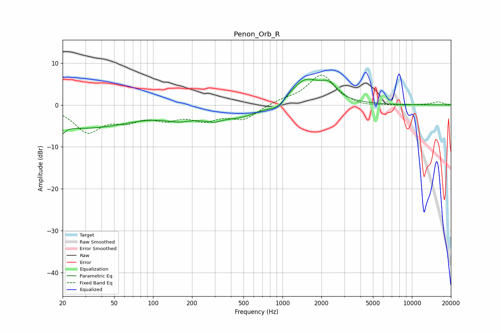

# Penon_Orb_R
See [usage instructions](https://github.com/jaakkopasanen/AutoEq#usage) for more options and info.

### Parametric EQs
Apply preamp of -6.2 dB when using parametric equalizer.

|   # | Type    |   Fc (Hz) |    Q |   Gain (dB) |
|-----|---------|-----------|------|-------------|
|   1 | Peaking |        20 | 5.82 |        -5.1 |
|   2 | Peaking |        20 | 5.84 |         3.3 |
|   3 | Peaking |        29 | 0.35 |        -5.4 |
|   4 | Peaking |       160 | 1.14 |        -2.1 |
|   5 | Peaking |       274 | 3.48 |         2.9 |
|   6 | Peaking |       276 | 2.83 |        -4.2 |
|   7 | Peaking |       460 | 0.79 |        -2.9 |
|   8 | Peaking |       917 | 2.55 |        -1.6 |
|   9 | Peaking |      1501 | 1.17 |         6.2 |
|  10 | Peaking |      2274 | 2.43 |         2.9 |

### Fixed Band EQs
When using fixed band (also called graphic) equalizer, apply preamp of **-7.2 dB** (if available) and set gains manually with these parameters.

|   # | Type    |   Fc (Hz) |    Q |   Gain (dB) |
|-----|---------|-----------|------|-------------|
|   1 | Peaking |        31 | 1.41 |        -6.1 |
|   2 | Peaking |        62 | 1.41 |        -2.9 |
|   3 | Peaking |       125 | 1.41 |        -2.7 |
|   4 | Peaking |       250 | 1.41 |        -3.1 |
|   5 | Peaking |       500 | 1.41 |        -3.2 |
|   6 | Peaking |      1000 | 1.41 |         0.9 |
|   7 | Peaking |      2000 | 1.41 |         7.2 |
|   8 | Peaking |      4000 | 1.41 |        -0.7 |
|   9 | Peaking |      8000 | 1.41 |        -0.1 |
|  10 | Peaking |     16000 | 1.41 |         0.7 |

### Graphs

