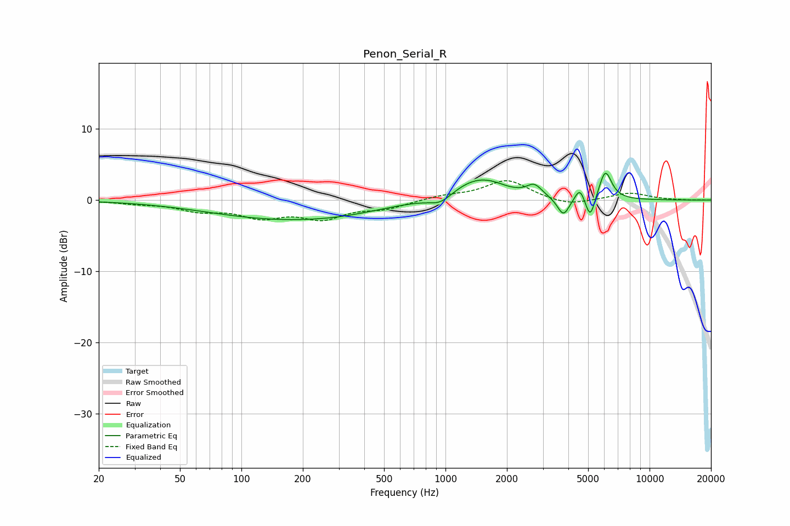

# Penon_Serial_R
See [usage instructions](https://github.com/jaakkopasanen/AutoEq#usage) for more options and info.

### Parametric EQs
Apply preamp of -3.9 dB when using parametric equalizer.

|   # | Type    |   Fc (Hz) |    Q |   Gain (dB) |
|-----|---------|-----------|------|-------------|
|   1 | Peaking |       166 | 0.38 |        -2.7 |
|   2 | Peaking |       312 | 0.96 |        -0.3 |
|   3 | Peaking |       946 | 2.45 |        -1.3 |
|   4 | Peaking |      1412 | 1.11 |         3   |
|   5 | Peaking |      1689 | 2.17 |         0.3 |
|   6 | Peaking |      2726 | 3.84 |         1.6 |
|   7 | Peaking |      3783 | 4.77 |        -2.6 |
|   8 | Peaking |      4553 | 6    |         1.9 |
|   9 | Peaking |      5121 | 6    |        -3.3 |
|  10 | Peaking |      6067 | 4.47 |         4.2 |

### Fixed Band EQs
When using fixed band (also called graphic) equalizer, apply preamp of **-2.8 dB** (if available) and set gains manually with these parameters.

|   # | Type    |   Fc (Hz) |    Q |   Gain (dB) |
|-----|---------|-----------|------|-------------|
|   1 | Peaking |        31 | 1.41 |        -0.4 |
|   2 | Peaking |        62 | 1.41 |        -1.3 |
|   3 | Peaking |       125 | 1.41 |        -2.1 |
|   4 | Peaking |       250 | 1.41 |        -2.3 |
|   5 | Peaking |       500 | 1.41 |        -1.1 |
|   6 | Peaking |      1000 | 1.41 |         0.6 |
|   7 | Peaking |      2000 | 1.41 |         2.8 |
|   8 | Peaking |      4000 | 1.41 |        -0.9 |
|   9 | Peaking |      8000 | 1.41 |         1   |
|  10 | Peaking |     16000 | 1.41 |        -0   |

### Graphs

