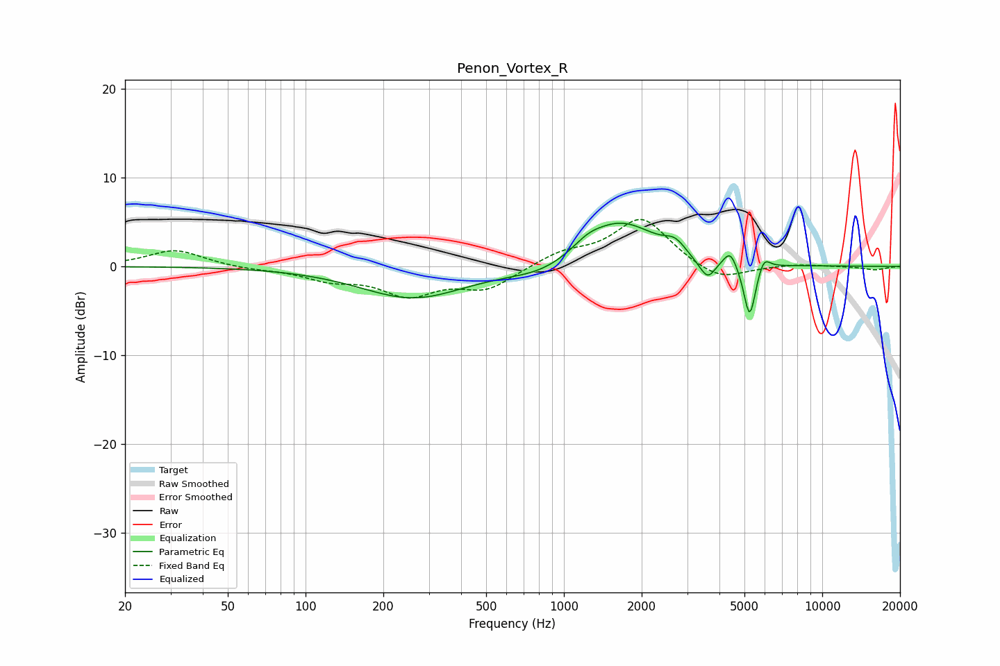

# Penon_Vortex_R
See [usage instructions](https://github.com/jaakkopasanen/AutoEq#usage) for more options and info.

### Parametric EQs
Apply preamp of -5.0 dB when using parametric equalizer.

|   # | Type    |   Fc (Hz) |    Q |   Gain (dB) |
|-----|---------|-----------|------|-------------|
|   1 | Peaking |       261 | 0.7  |        -3.6 |
|   2 | Peaking |       828 | 1.1  |        -1.2 |
|   3 | Peaking |      1236 | 2.44 |         0.9 |
|   4 | Peaking |      1656 | 1    |         5   |
|   5 | Peaking |      2694 | 3.54 |         1.3 |
|   6 | Peaking |      3421 | 3.09 |        -0.8 |
|   7 | Peaking |      3616 | 5.1  |        -1.7 |
|   8 | Peaking |      4403 | 5.56 |         1.8 |
|   9 | Peaking |      5238 | 6    |        -6.3 |
|  10 | Peaking |      5940 | 6    |         1.6 |

### Fixed Band EQs
When using fixed band (also called graphic) equalizer, apply preamp of **-5.4 dB** (if available) and set gains manually with these parameters.

|   # | Type    |   Fc (Hz) |    Q |   Gain (dB) |
|-----|---------|-----------|------|-------------|
|   1 | Peaking |        31 | 1.41 |         1.9 |
|   2 | Peaking |        62 | 1.41 |        -0.3 |
|   3 | Peaking |       125 | 1.41 |        -1.3 |
|   4 | Peaking |       250 | 1.41 |        -3   |
|   5 | Peaking |       500 | 1.41 |        -2.4 |
|   6 | Peaking |      1000 | 1.41 |         1.4 |
|   7 | Peaking |      2000 | 1.41 |         5.4 |
|   8 | Peaking |      4000 | 1.41 |        -1.8 |
|   9 | Peaking |      8000 | 1.41 |         0.3 |
|  10 | Peaking |     16000 | 1.41 |        -0.4 |

### Graphs

