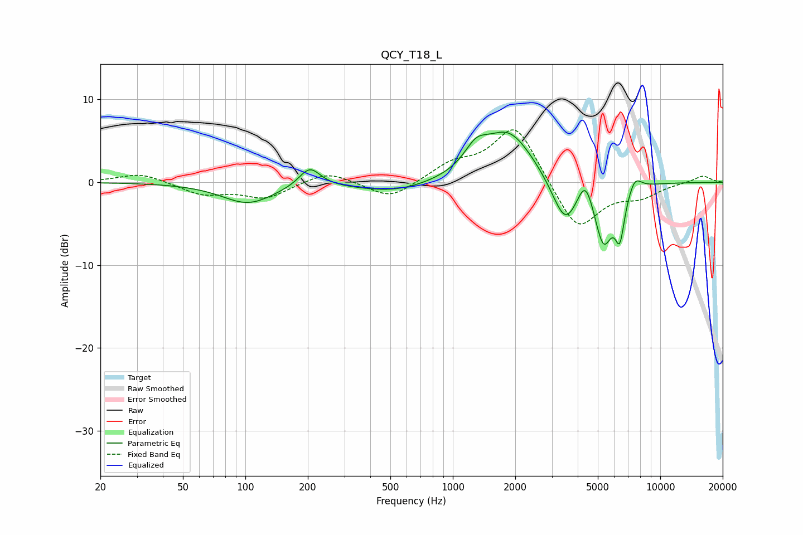

# QCY_T18_L
See [usage instructions](https://github.com/jaakkopasanen/AutoEq#usage) for more options and info.

### Parametric EQs
Apply preamp of -6.2 dB when using parametric equalizer.

|   # | Type    |   Fc (Hz) |    Q |   Gain (dB) |
|-----|---------|-----------|------|-------------|
|   1 | Peaking |       103 | 1.12 |        -2.5 |
|   2 | Peaking |       204 | 2.74 |         2.4 |
|   3 | Peaking |       529 | 0.8  |        -1.3 |
|   4 | Peaking |      1295 | 2.53 |         2.4 |
|   5 | Peaking |      1859 | 1.14 |         6.2 |
|   6 | Peaking |      3483 | 2.18 |        -5.7 |
|   7 | Peaking |      4353 | 3.74 |         3.4 |
|   8 | Peaking |      5324 | 3.08 |        -7.3 |
|   9 | Peaking |      6387 | 6    |        -5.1 |
|  10 | Peaking |      7543 | 4.26 |         1.7 |

### Fixed Band EQs
When using fixed band (also called graphic) equalizer, apply preamp of **-6.4 dB** (if available) and set gains manually with these parameters.

|   # | Type    |   Fc (Hz) |    Q |   Gain (dB) |
|-----|---------|-----------|------|-------------|
|   1 | Peaking |        31 | 1.41 |         1.1 |
|   2 | Peaking |        62 | 1.41 |        -1.4 |
|   3 | Peaking |       125 | 1.41 |        -1.9 |
|   4 | Peaking |       250 | 1.41 |         1.4 |
|   5 | Peaking |       500 | 1.41 |        -2.1 |
|   6 | Peaking |      1000 | 1.41 |         1.9 |
|   7 | Peaking |      2000 | 1.41 |         7.1 |
|   8 | Peaking |      4000 | 1.41 |        -6.1 |
|   9 | Peaking |      8000 | 1.41 |        -1.5 |
|  10 | Peaking |     16000 | 1.41 |         0.8 |

### Graphs

