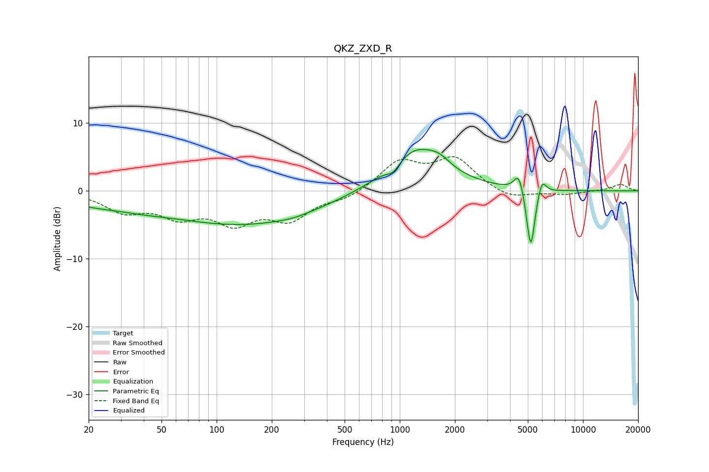

# QKZ_ZXD_R
See [usage instructions](https://github.com/jaakkopasanen/AutoEq#usage) for more options and info.

### Parametric EQs
Apply preamp of -6.2 dB when using parametric equalizer.

|   # | Type    |   Fc (Hz) |    Q |   Gain (dB) |
|-----|---------|-----------|------|-------------|
|   1 | Peaking |        20 | 1.03 |        -1.1 |
|   2 | Peaking |        36 | 0.78 |        -1.1 |
|   3 | Peaking |       141 | 0.34 |        -4.9 |
|   4 | Peaking |       261 | 1.64 |        -0.3 |
|   5 | Peaking |       924 | 3.68 |        -1.4 |
|   6 | Peaking |      1214 | 0.92 |         6.5 |
|   7 | Peaking |      1648 | 2.56 |         1.1 |
|   8 | Peaking |      4470 | 5.42 |         3   |
|   9 | Peaking |      5189 | 6    |        -9.4 |
|  10 | Peaking |      5960 | 5.94 |         2.5 |

### Fixed Band EQs
When using fixed band (also called graphic) equalizer, apply preamp of **-5.2 dB** (if available) and set gains manually with these parameters.

|   # | Type    |   Fc (Hz) |    Q |   Gain (dB) |
|-----|---------|-----------|------|-------------|
|   1 | Peaking |        31 | 1.41 |        -2.7 |
|   2 | Peaking |        62 | 1.41 |        -3.2 |
|   3 | Peaking |       125 | 1.41 |        -4.1 |
|   4 | Peaking |       250 | 1.41 |        -3.8 |
|   5 | Peaking |       500 | 1.41 |        -1.1 |
|   6 | Peaking |      1000 | 1.41 |         4.2 |
|   7 | Peaking |      2000 | 1.41 |         4.6 |
|   8 | Peaking |      4000 | 1.41 |        -1.3 |
|   9 | Peaking |      8000 | 1.41 |        -0.5 |
|  10 | Peaking |     16000 | 1.41 |         1   |

### Graphs

