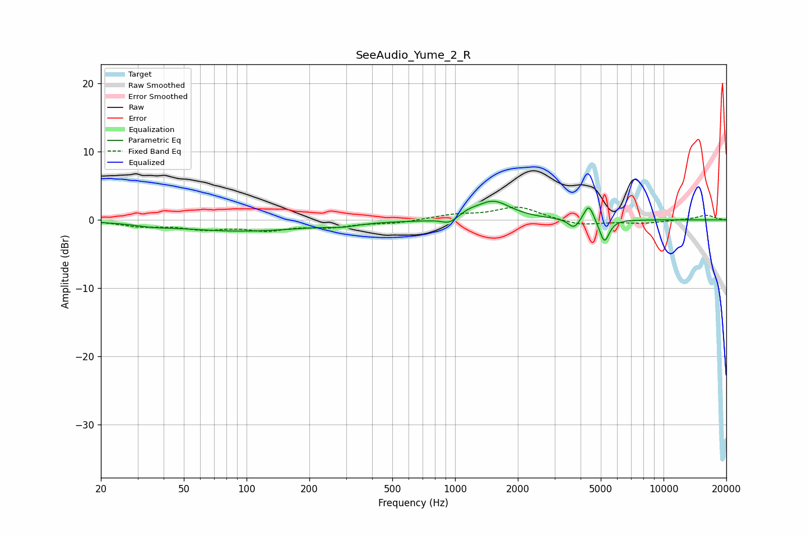

# SeeAudio_Yume_2_R
See [usage instructions](https://github.com/jaakkopasanen/AutoEq#usage) for more options and info.

### Parametric EQs
Apply preamp of -2.8 dB when using parametric equalizer.

|   # | Type    |   Fc (Hz) |    Q |   Gain (dB) |
|-----|---------|-----------|------|-------------|
|   1 | Peaking |        35 | 1.86 |        -0.3 |
|   2 | Peaking |        95 | 0.43 |        -1.6 |
|   3 | Peaking |       291 | 2.06 |        -0.4 |
|   4 | Peaking |       711 | 1.3  |        -0.2 |
|   5 | Peaking |       939 | 3.87 |        -0.9 |
|   6 | Peaking |      1161 | 3.5  |         0.5 |
|   7 | Peaking |      1522 | 1.68 |         2.8 |
|   8 | Peaking |      3722 | 5.29 |        -1.5 |
|   9 | Peaking |      4377 | 6    |         2.5 |
|  10 | Peaking |      5203 | 6    |        -3.4 |

### Fixed Band EQs
When using fixed band (also called graphic) equalizer, apply preamp of **-2.0 dB** (if available) and set gains manually with these parameters.

|   # | Type    |   Fc (Hz) |    Q |   Gain (dB) |
|-----|---------|-----------|------|-------------|
|   1 | Peaking |        31 | 1.41 |        -0.8 |
|   2 | Peaking |        62 | 1.41 |        -1.1 |
|   3 | Peaking |       125 | 1.41 |        -1.3 |
|   4 | Peaking |       250 | 1.41 |        -0.9 |
|   5 | Peaking |       500 | 1.41 |        -0.5 |
|   6 | Peaking |      1000 | 1.41 |         0.7 |
|   7 | Peaking |      2000 | 1.41 |         1.9 |
|   8 | Peaking |      4000 | 1.41 |        -0.8 |
|   9 | Peaking |      8000 | 1.41 |        -0.5 |
|  10 | Peaking |     16000 | 1.41 |         0.7 |

### Graphs

