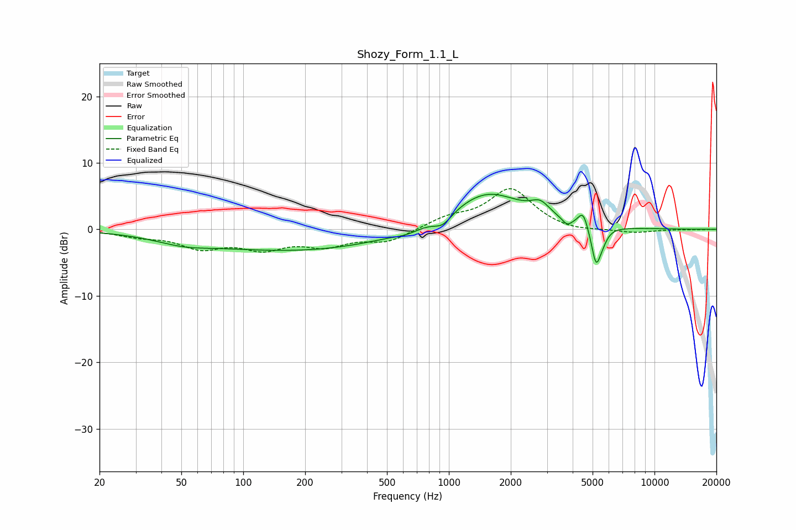

# Shozy_Form_1.1_L
See [usage instructions](https://github.com/jaakkopasanen/AutoEq#usage) for more options and info.

### Parametric EQs
Apply preamp of -5.4 dB when using parametric equalizer.

|   # | Type    |   Fc (Hz) |    Q |   Gain (dB) |
|-----|---------|-----------|------|-------------|
|   1 | Peaking |        51 | 1.07 |        -1   |
|   2 | Peaking |       183 | 0.3  |        -3.2 |
|   3 | Peaking |       622 | 2.57 |        -0.5 |
|   4 | Peaking |       934 | 3.27 |        -1.6 |
|   5 | Peaking |      1532 | 0.8  |         5.7 |
|   6 | Peaking |      2785 | 3.09 |         1.9 |
|   7 | Peaking |      3755 | 6    |        -1   |
|   8 | Peaking |      4496 | 5.98 |         2.4 |
|   9 | Peaking |      5199 | 6    |        -5.7 |
|  10 | Peaking |      5613 | 6    |        -1   |

### Fixed Band EQs
When using fixed band (also called graphic) equalizer, apply preamp of **-6.2 dB** (if available) and set gains manually with these parameters.

|   # | Type    |   Fc (Hz) |    Q |   Gain (dB) |
|-----|---------|-----------|------|-------------|
|   1 | Peaking |        31 | 1.41 |        -0.9 |
|   2 | Peaking |        62 | 1.41 |        -2.5 |
|   3 | Peaking |       125 | 1.41 |        -2.5 |
|   4 | Peaking |       250 | 1.41 |        -2.1 |
|   5 | Peaking |       500 | 1.41 |        -1.8 |
|   6 | Peaking |      1000 | 1.41 |         1.5 |
|   7 | Peaking |      2000 | 1.41 |         6   |
|   8 | Peaking |      4000 | 1.41 |        -0.5 |
|   9 | Peaking |      8000 | 1.41 |        -0.5 |
|  10 | Peaking |     16000 | 1.41 |        -0   |

### Graphs

