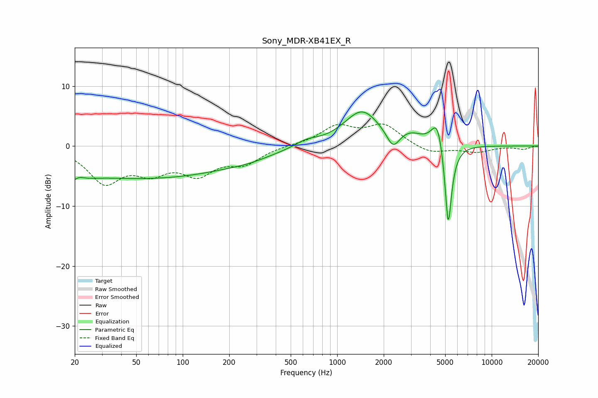

# Sony_MDR-XB41EX_R
See [usage instructions](https://github.com/jaakkopasanen/AutoEq#usage) for more options and info.

### Parametric EQs
Apply preamp of -5.8 dB when using parametric equalizer.

|   # | Type    |   Fc (Hz) |    Q |   Gain (dB) |
|-----|---------|-----------|------|-------------|
|   1 | Peaking |        20 | 2.37 |        -4.8 |
|   2 | Peaking |        21 | 3.11 |         3.5 |
|   3 | Peaking |        57 | 0.22 |        -5.3 |
|   4 | Peaking |       269 | 1.25 |        -0.4 |
|   5 | Peaking |       631 | 1.83 |         1   |
|   6 | Peaking |      1448 | 1.2  |         5.9 |
|   7 | Peaking |      2298 | 3.43 |        -2.9 |
|   8 | Peaking |      2980 | 1.92 |         1.5 |
|   9 | Peaking |      4468 | 3.56 |         5.2 |
|  10 | Peaking |      5234 | 6    |       -15.1 |

### Fixed Band EQs
When using fixed band (also called graphic) equalizer, apply preamp of **-3.8 dB** (if available) and set gains manually with these parameters.

|   # | Type    |   Fc (Hz) |    Q |   Gain (dB) |
|-----|---------|-----------|------|-------------|
|   1 | Peaking |        31 | 1.41 |        -5.7 |
|   2 | Peaking |        62 | 1.41 |        -3.5 |
|   3 | Peaking |       125 | 1.41 |        -4.1 |
|   4 | Peaking |       250 | 1.41 |        -2.6 |
|   5 | Peaking |       500 | 1.41 |         0.1 |
|   6 | Peaking |      1000 | 1.41 |         3.1 |
|   7 | Peaking |      2000 | 1.41 |         3.3 |
|   8 | Peaking |      4000 | 1.41 |        -1.3 |
|   9 | Peaking |      8000 | 1.41 |        -1   |
|  10 | Peaking |     16000 | 1.41 |        -0.5 |

### Graphs

