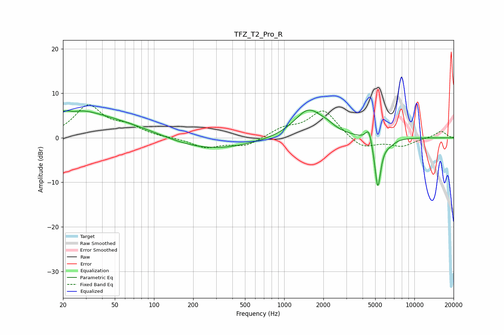

# TFZ_T2_Pro_R
See [usage instructions](https://github.com/jaakkopasanen/AutoEq#usage) for more options and info.

### Parametric EQs
Apply preamp of -6.3 dB when using parametric equalizer.

|   # | Type    |   Fc (Hz) |    Q |   Gain (dB) |
|-----|---------|-----------|------|-------------|
|   1 | Peaking |        24 | 0.2  |         4.8 |
|   2 | Peaking |        25 | 5.71 |        -3.6 |
|   3 | Peaking |        25 | 5.93 |         3.2 |
|   4 | Peaking |        26 | 0.84 |         1.7 |
|   5 | Peaking |       237 | 0.41 |        -3.2 |
|   6 | Peaking |      1537 | 1.28 |         6.4 |
|   7 | Peaking |      2127 | 2.65 |         0.8 |
|   8 | Peaking |      4466 | 5.71 |         3.3 |
|   9 | Peaking |      5233 | 5.8  |       -11.6 |
|  10 | Peaking |      6478 | 3.2  |        -1   |

### Fixed Band EQs
When using fixed band (also called graphic) equalizer, apply preamp of **-7.5 dB** (if available) and set gains manually with these parameters.

|   # | Type    |   Fc (Hz) |    Q |   Gain (dB) |
|-----|---------|-----------|------|-------------|
|   1 | Peaking |        31 | 1.41 |         7   |
|   2 | Peaking |        62 | 1.41 |         2.2 |
|   3 | Peaking |       125 | 1.41 |         0   |
|   4 | Peaking |       250 | 1.41 |        -2.1 |
|   5 | Peaking |       500 | 1.41 |        -1.9 |
|   6 | Peaking |      1000 | 1.41 |         1.9 |
|   7 | Peaking |      2000 | 1.41 |         6.2 |
|   8 | Peaking |      4000 | 1.41 |        -2.6 |
|   9 | Peaking |      8000 | 1.41 |        -1.8 |
|  10 | Peaking |     16000 | 1.41 |         1.5 |

### Graphs

