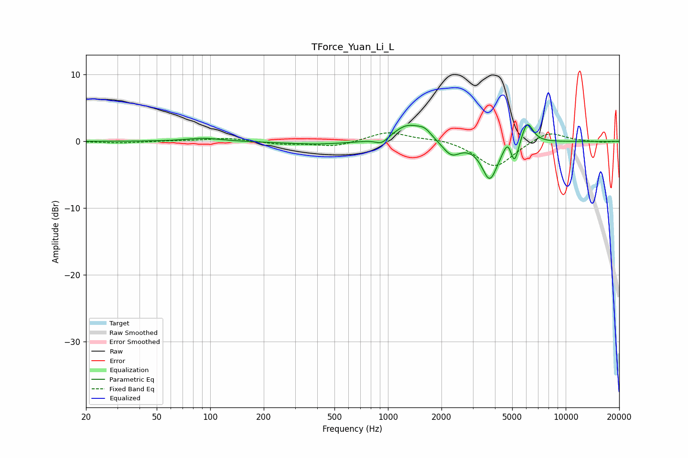

# TForce_Yuan_Li_L
See [usage instructions](https://github.com/jaakkopasanen/AutoEq#usage) for more options and info.

### Parametric EQs
Apply preamp of -2.6 dB when using parametric equalizer.

|   # | Type    |   Fc (Hz) |    Q |   Gain (dB) |
|-----|---------|-----------|------|-------------|
|   1 | Peaking |        92 | 1.47 |         0.5 |
|   2 | Peaking |       409 | 0.73 |        -0.5 |
|   3 | Peaking |       924 | 4    |        -1   |
|   4 | Peaking |      1292 | 1.73 |         2.5 |
|   5 | Peaking |      1612 | 3.71 |         1.1 |
|   6 | Peaking |      2273 | 2.86 |        -2.1 |
|   7 | Peaking |      3740 | 3.13 |        -5.6 |
|   8 | Peaking |      4724 | 6    |         1.8 |
|   9 | Peaking |      5148 | 6    |        -3.4 |
|  10 | Peaking |      6070 | 4.17 |         3.4 |

### Fixed Band EQs
When using fixed band (also called graphic) equalizer, apply preamp of **-1.4 dB** (if available) and set gains manually with these parameters.

|   # | Type    |   Fc (Hz) |    Q |   Gain (dB) |
|-----|---------|-----------|------|-------------|
|   1 | Peaking |        31 | 1.41 |        -0.2 |
|   2 | Peaking |        62 | 1.41 |         0.1 |
|   3 | Peaking |       125 | 1.41 |         0.5 |
|   4 | Peaking |       250 | 1.41 |        -0.4 |
|   5 | Peaking |       500 | 1.41 |        -0.8 |
|   6 | Peaking |      1000 | 1.41 |         1.5 |
|   7 | Peaking |      2000 | 1.41 |         0.4 |
|   8 | Peaking |      4000 | 1.41 |        -4   |
|   9 | Peaking |      8000 | 1.41 |         1.6 |
|  10 | Peaking |     16000 | 1.41 |        -0.2 |

### Graphs

