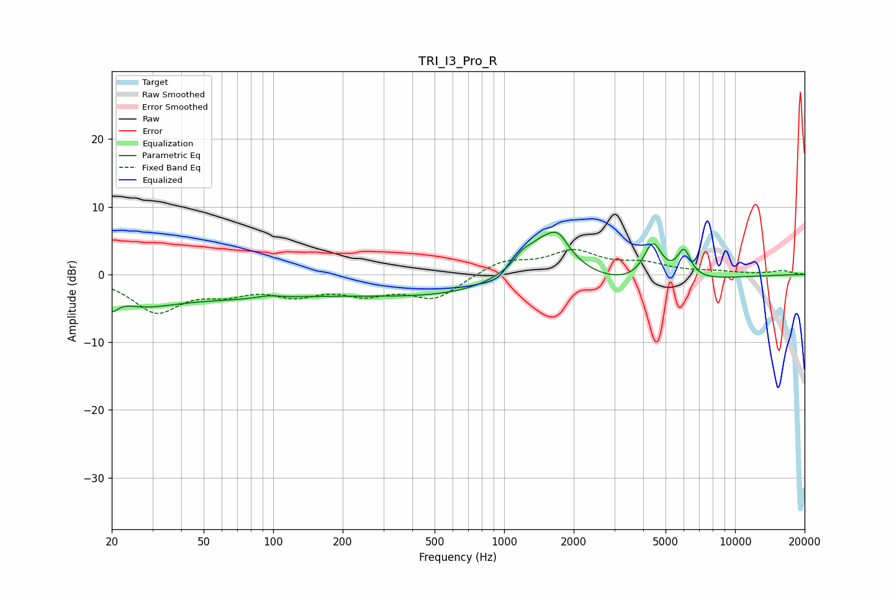

# TRI_I3_Pro_R
See [usage instructions](https://github.com/jaakkopasanen/AutoEq#usage) for more options and info.

### Parametric EQs
Apply preamp of -6.3 dB when using parametric equalizer.

|   # | Type    |   Fc (Hz) |    Q |   Gain (dB) |
|-----|---------|-----------|------|-------------|
|   1 | Peaking |        20 | 5.49 |        -2.1 |
|   2 | Peaking |        27 | 1.02 |        -2.4 |
|   3 | Peaking |        59 | 0.37 |        -3   |
|   4 | Peaking |        95 | 2.95 |         0.4 |
|   5 | Peaking |      1050 | 0.19 |        -3.8 |
|   6 | Peaking |      1195 | 4.9  |         0.8 |
|   7 | Peaking |      1515 | 1.15 |         8.5 |
|   8 | Peaking |      1723 | 3.79 |         1.8 |
|   9 | Peaking |      4405 | 3.46 |         5.6 |
|  10 | Peaking |      6014 | 4.65 |         4.1 |

### Fixed Band EQs
When using fixed band (also called graphic) equalizer, apply preamp of **-3.8 dB** (if available) and set gains manually with these parameters.

|   # | Type    |   Fc (Hz) |    Q |   Gain (dB) |
|-----|---------|-----------|------|-------------|
|   1 | Peaking |        31 | 1.41 |        -5.2 |
|   2 | Peaking |        62 | 1.41 |        -2.1 |
|   3 | Peaking |       125 | 1.41 |        -2.5 |
|   4 | Peaking |       250 | 1.41 |        -2.4 |
|   5 | Peaking |       500 | 1.41 |        -3.4 |
|   6 | Peaking |      1000 | 1.41 |         2   |
|   7 | Peaking |      2000 | 1.41 |         3.2 |
|   8 | Peaking |      4000 | 1.41 |         1.4 |
|   9 | Peaking |      8000 | 1.41 |         0.3 |
|  10 | Peaking |     16000 | 1.41 |         0.5 |

### Graphs

