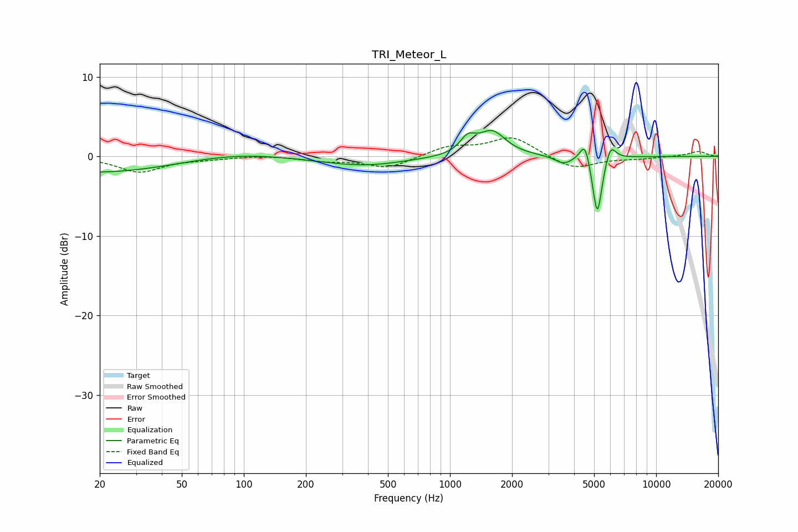

# TRI_Meteor_L
See [usage instructions](https://github.com/jaakkopasanen/AutoEq#usage) for more options and info.

### Parametric EQs
Apply preamp of -3.4 dB when using parametric equalizer.

|   # | Type    |   Fc (Hz) |    Q |   Gain (dB) |
|-----|---------|-----------|------|-------------|
|   1 | Peaking |        39 | 0.18 |        -2.6 |
|   2 | Peaking |        45 | 1.05 |         0   |
|   3 | Peaking |        92 | 0.47 |         2.4 |
|   4 | Peaking |       390 | 0.75 |        -1   |
|   5 | Peaking |      1220 | 3.74 |         1.8 |
|   6 | Peaking |      1601 | 2.13 |         3   |
|   7 | Peaking |      3564 | 3.36 |        -1   |
|   8 | Peaking |      4519 | 5.87 |         2.7 |
|   9 | Peaking |      5182 | 5.98 |        -7.8 |
|  10 | Peaking |      6003 | 5.42 |         2.2 |

### Fixed Band EQs
When using fixed band (also called graphic) equalizer, apply preamp of **-2.4 dB** (if available) and set gains manually with these parameters.

|   # | Type    |   Fc (Hz) |    Q |   Gain (dB) |
|-----|---------|-----------|------|-------------|
|   1 | Peaking |        31 | 1.41 |        -1.9 |
|   2 | Peaking |        62 | 1.41 |        -0.3 |
|   3 | Peaking |       125 | 1.41 |         0.2 |
|   4 | Peaking |       250 | 1.41 |        -0.5 |
|   5 | Peaking |       500 | 1.41 |        -1.5 |
|   6 | Peaking |      1000 | 1.41 |         1.2 |
|   7 | Peaking |      2000 | 1.41 |         2.4 |
|   8 | Peaking |      4000 | 1.41 |        -1.7 |
|   9 | Peaking |      8000 | 1.41 |        -0.3 |
|  10 | Peaking |     16000 | 1.41 |         0.6 |

### Graphs

