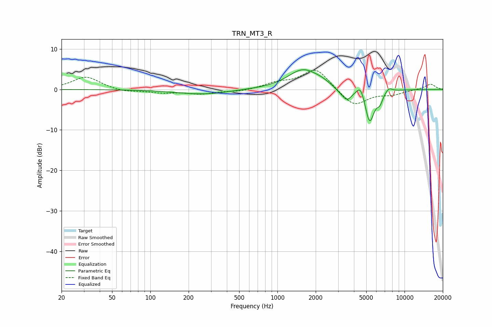

# TRN_MT3_R
See [usage instructions](https://github.com/jaakkopasanen/AutoEq#usage) for more options and info.

### Parametric EQs
Apply preamp of -5.0 dB when using parametric equalizer.

|   # | Type    |   Fc (Hz) |    Q |   Gain (dB) |
|-----|---------|-----------|------|-------------|
|   1 | Peaking |       264 | 0.66 |        -1.2 |
|   2 | Peaking |       522 | 1.14 |         0.1 |
|   3 | Peaking |      1593 | 1.18 |         4.9 |
|   4 | Peaking |      2226 | 2.33 |         0.6 |
|   5 | Peaking |      3109 | 3.06 |        -0.8 |
|   6 | Peaking |      3534 | 3.82 |        -2.5 |
|   7 | Peaking |      4514 | 4.74 |         2.9 |
|   8 | Peaking |      5313 | 3.69 |        -8.4 |
|   9 | Peaking |      6400 | 6    |        -2.1 |
|  10 | Peaking |      7527 | 4.87 |         1.1 |

### Fixed Band EQs
When using fixed band (also called graphic) equalizer, apply preamp of **-4.8 dB** (if available) and set gains manually with these parameters.

|   # | Type    |   Fc (Hz) |    Q |   Gain (dB) |
|-----|---------|-----------|------|-------------|
|   1 | Peaking |        31 | 1.41 |         3.2 |
|   2 | Peaking |        62 | 1.41 |        -0.7 |
|   3 | Peaking |       125 | 1.41 |        -0.7 |
|   4 | Peaking |       250 | 1.41 |        -1   |
|   5 | Peaking |       500 | 1.41 |        -0.5 |
|   6 | Peaking |      1000 | 1.41 |         1.4 |
|   7 | Peaking |      2000 | 1.41 |         5.3 |
|   8 | Peaking |      4000 | 1.41 |        -4.3 |
|   9 | Peaking |      8000 | 1.41 |        -1.1 |
|  10 | Peaking |     16000 | 1.41 |         1.4 |

### Graphs

