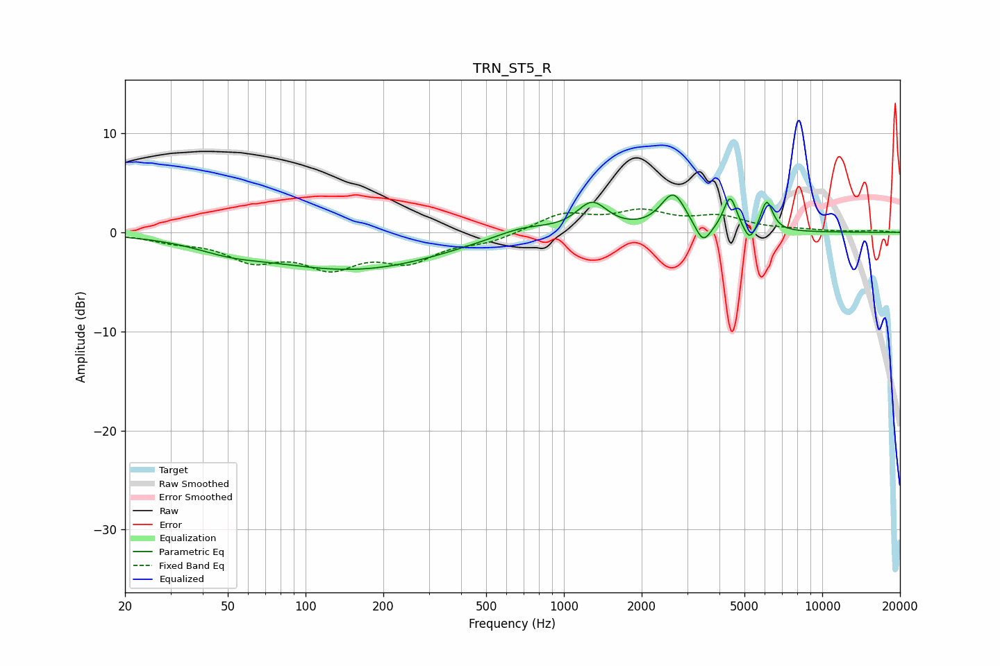

# TRN_ST5_R
See [usage instructions](https://github.com/jaakkopasanen/AutoEq#usage) for more options and info.

### Parametric EQs
Apply preamp of -3.9 dB when using parametric equalizer.

|   # | Type    |   Fc (Hz) |    Q |   Gain (dB) |
|-----|---------|-----------|------|-------------|
|   1 | Peaking |        51 | 1.11 |        -0.8 |
|   2 | Peaking |       156 | 0.39 |        -3.7 |
|   3 | Peaking |       409 | 0.79 |         0.2 |
|   4 | Peaking |       693 | 1.24 |         1   |
|   5 | Peaking |      1287 | 2.37 |         2.9 |
|   6 | Peaking |      2652 | 2.88 |         3.8 |
|   7 | Peaking |      3456 | 4.65 |        -2.1 |
|   8 | Peaking |      4401 | 5.59 |         3.4 |
|   9 | Peaking |      5244 | 6    |        -1.6 |
|  10 | Peaking |      6098 | 6    |         3.1 |

### Fixed Band EQs
When using fixed band (also called graphic) equalizer, apply preamp of **-2.5 dB** (if available) and set gains manually with these parameters.

|   # | Type    |   Fc (Hz) |    Q |   Gain (dB) |
|-----|---------|-----------|------|-------------|
|   1 | Peaking |        31 | 1.41 |        -0.7 |
|   2 | Peaking |        62 | 1.41 |        -2.5 |
|   3 | Peaking |       125 | 1.41 |        -3   |
|   4 | Peaking |       250 | 1.41 |        -2.6 |
|   5 | Peaking |       500 | 1.41 |        -0.9 |
|   6 | Peaking |      1000 | 1.41 |         1.8 |
|   7 | Peaking |      2000 | 1.41 |         1.8 |
|   8 | Peaking |      4000 | 1.41 |         1.4 |
|   9 | Peaking |      8000 | 1.41 |         0.2 |
|  10 | Peaking |     16000 | 1.41 |         0.2 |

### Graphs

