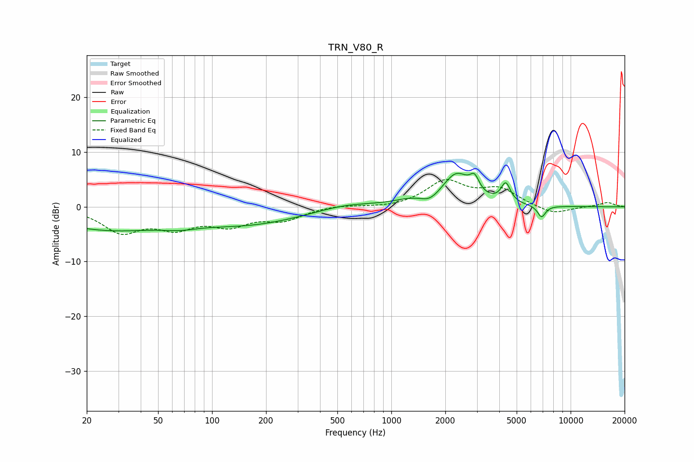

# TRN_V80_R
See [usage instructions](https://github.com/jaakkopasanen/AutoEq#usage) for more options and info.

### Parametric EQs
Apply preamp of -6.2 dB when using parametric equalizer.

|   # | Type    |   Fc (Hz) |    Q |   Gain (dB) |
|-----|---------|-----------|------|-------------|
|   1 | Peaking |        26 | 0.43 |        -4   |
|   2 | Peaking |        66 | 1.52 |        -0.7 |
|   3 | Peaking |       163 | 0.46 |        -2.9 |
|   4 | Peaking |       553 | 0.87 |         1   |
|   5 | Peaking |      1305 | 1.44 |         1   |
|   6 | Peaking |      1638 | 2.7  |        -1.3 |
|   7 | Peaking |      2306 | 1.81 |         5.7 |
|   8 | Peaking |      2911 | 5.5  |         2.6 |
|   9 | Peaking |      4349 | 5.45 |         3.5 |
|  10 | Peaking |      6883 | 6    |        -2.2 |

### Fixed Band EQs
When using fixed band (also called graphic) equalizer, apply preamp of **-5.1 dB** (if available) and set gains manually with these parameters.

|   # | Type    |   Fc (Hz) |    Q |   Gain (dB) |
|-----|---------|-----------|------|-------------|
|   1 | Peaking |        31 | 1.41 |        -4.3 |
|   2 | Peaking |        62 | 1.41 |        -3.3 |
|   3 | Peaking |       125 | 1.41 |        -2.9 |
|   4 | Peaking |       250 | 1.41 |        -2.2 |
|   5 | Peaking |       500 | 1.41 |         0.4 |
|   6 | Peaking |      1000 | 1.41 |        -0.3 |
|   7 | Peaking |      2000 | 1.41 |         4.5 |
|   8 | Peaking |      4000 | 1.41 |         3   |
|   9 | Peaking |      8000 | 1.41 |        -1.5 |
|  10 | Peaking |     16000 | 1.41 |         0.8 |

### Graphs

