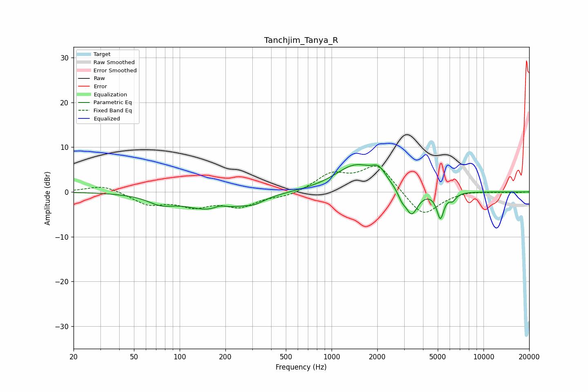

# Tanchjim_Tanya_R
See [usage instructions](https://github.com/jaakkopasanen/AutoEq#usage) for more options and info.

### Parametric EQs
Apply preamp of -6.2 dB when using parametric equalizer.

|   # | Type    |   Fc (Hz) |    Q |   Gain (dB) |
|-----|---------|-----------|------|-------------|
|   1 | Peaking |        75 | 1.73 |        -1.7 |
|   2 | Peaking |       167 | 0.76 |        -4   |
|   3 | Peaking |       185 | 3.24 |         1   |
|   4 | Peaking |       309 | 2.09 |        -1.2 |
|   5 | Peaking |      1436 | 1.03 |         5.9 |
|   6 | Peaking |      2048 | 3.12 |         2.6 |
|   7 | Peaking |      2897 | 5.47 |        -1.6 |
|   8 | Peaking |      3364 | 3.41 |        -5.7 |
|   9 | Peaking |      5203 | 5.94 |        -5.7 |
|  10 | Peaking |      6267 | 6    |        -1.4 |

### Fixed Band EQs
When using fixed band (also called graphic) equalizer, apply preamp of **-5.9 dB** (if available) and set gains manually with these parameters.

|   # | Type    |   Fc (Hz) |    Q |   Gain (dB) |
|-----|---------|-----------|------|-------------|
|   1 | Peaking |        31 | 1.41 |         1.6 |
|   2 | Peaking |        62 | 1.41 |        -2.7 |
|   3 | Peaking |       125 | 1.41 |        -2.8 |
|   4 | Peaking |       250 | 1.41 |        -2.9 |
|   5 | Peaking |       500 | 1.41 |        -1   |
|   6 | Peaking |      1000 | 1.41 |         3.7 |
|   7 | Peaking |      2000 | 1.41 |         6.1 |
|   8 | Peaking |      4000 | 1.41 |        -5.7 |
|   9 | Peaking |      8000 | 1.41 |         0.3 |
|  10 | Peaking |     16000 | 1.41 |        -0.1 |

### Graphs

