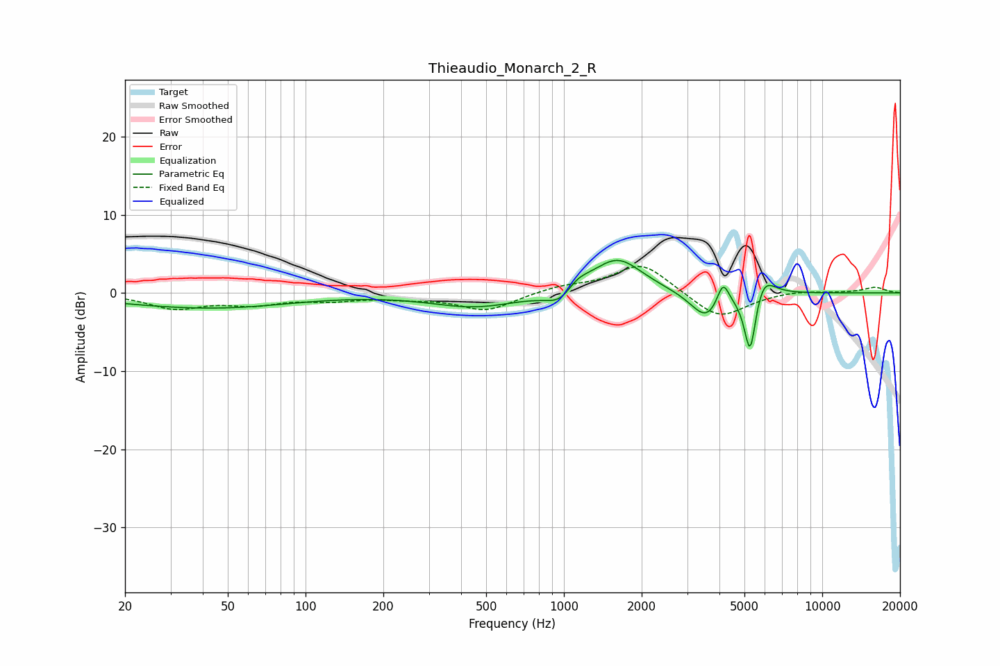

# Thieaudio_Monarch_2_R
See [usage instructions](https://github.com/jaakkopasanen/AutoEq#usage) for more options and info.

### Parametric EQs
Apply preamp of -4.2 dB when using parametric equalizer.

|   # | Type    |   Fc (Hz) |    Q |   Gain (dB) |
|-----|---------|-----------|------|-------------|
|   1 | Peaking |        36 | 0.42 |        -1.6 |
|   2 | Peaking |        59 | 0.61 |        -0.4 |
|   3 | Peaking |       454 | 0.82 |        -1.8 |
|   4 | Peaking |      1001 | 2.31 |        -3.1 |
|   5 | Peaking |      1095 | 2.58 |         2.5 |
|   6 | Peaking |      1610 | 1.44 |         4.6 |
|   7 | Peaking |      3566 | 2.33 |        -3.6 |
|   8 | Peaking |      4128 | 5.97 |         3.2 |
|   9 | Peaking |      5260 | 6    |        -8.4 |
|  10 | Peaking |      5882 | 3.27 |         3   |

### Fixed Band EQs
When using fixed band (also called graphic) equalizer, apply preamp of **-3.5 dB** (if available) and set gains manually with these parameters.

|   # | Type    |   Fc (Hz) |    Q |   Gain (dB) |
|-----|---------|-----------|------|-------------|
|   1 | Peaking |        31 | 1.41 |        -1.9 |
|   2 | Peaking |        62 | 1.41 |        -1.3 |
|   3 | Peaking |       125 | 1.41 |        -0.8 |
|   4 | Peaking |       250 | 1.41 |        -0.5 |
|   5 | Peaking |       500 | 1.41 |        -2.2 |
|   6 | Peaking |      1000 | 1.41 |         0.8 |
|   7 | Peaking |      2000 | 1.41 |         3.9 |
|   8 | Peaking |      4000 | 1.41 |        -3.4 |
|   9 | Peaking |      8000 | 1.41 |         0.4 |
|  10 | Peaking |     16000 | 1.41 |         0.7 |

### Graphs

