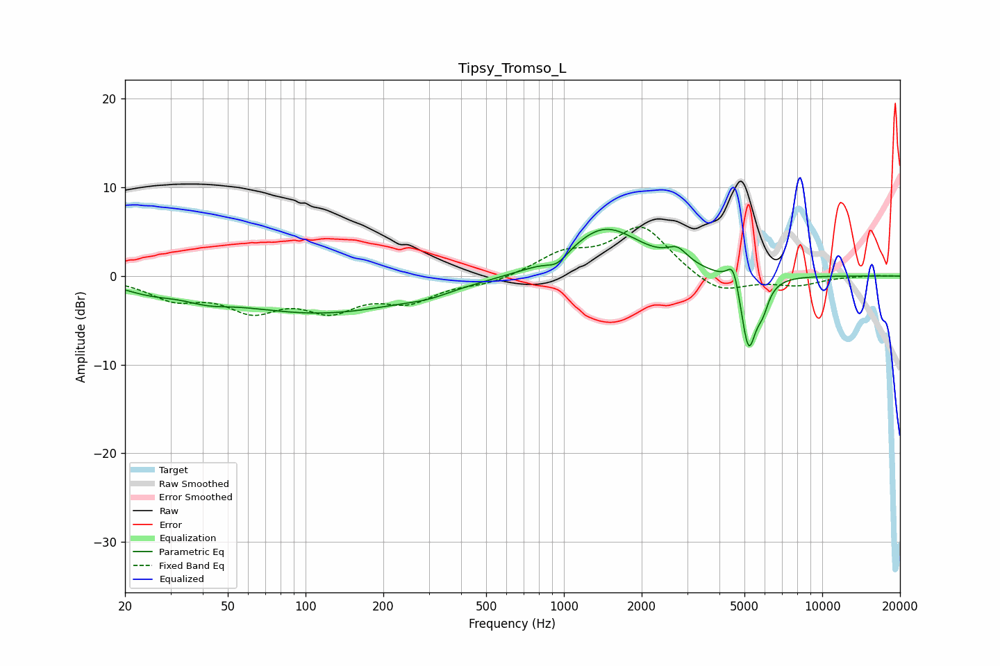

# Tipsy_Tromso_L
See [usage instructions](https://github.com/jaakkopasanen/AutoEq#usage) for more options and info.

### Parametric EQs
Apply preamp of -5.4 dB when using parametric equalizer.

|   # | Type    |   Fc (Hz) |    Q |   Gain (dB) |
|-----|---------|-----------|------|-------------|
|   1 | Peaking |        25 | 1.34 |        -1   |
|   2 | Peaking |        42 | 1.65 |        -0.8 |
|   3 | Peaking |       115 | 0.38 |        -4.1 |
|   4 | Peaking |       298 | 1.78 |        -0.5 |
|   5 | Peaking |       944 | 3.38 |        -1.2 |
|   6 | Peaking |      1440 | 0.99 |         5.5 |
|   7 | Peaking |      2750 | 3.49 |         1.6 |
|   8 | Peaking |      4531 | 6    |         3   |
|   9 | Peaking |      5184 | 4.56 |        -8.6 |
|  10 | Peaking |      5885 | 6    |        -2.1 |

### Fixed Band EQs
When using fixed band (also called graphic) equalizer, apply preamp of **-5.6 dB** (if available) and set gains manually with these parameters.

|   # | Type    |   Fc (Hz) |    Q |   Gain (dB) |
|-----|---------|-----------|------|-------------|
|   1 | Peaking |        31 | 1.41 |        -2.3 |
|   2 | Peaking |        62 | 1.41 |        -3.3 |
|   3 | Peaking |       125 | 1.41 |        -3.3 |
|   4 | Peaking |       250 | 1.41 |        -2.5 |
|   5 | Peaking |       500 | 1.41 |        -0.8 |
|   6 | Peaking |      1000 | 1.41 |         2.3 |
|   7 | Peaking |      2000 | 1.41 |         5.5 |
|   8 | Peaking |      4000 | 1.41 |        -2.2 |
|   9 | Peaking |      8000 | 1.41 |        -1   |
|  10 | Peaking |     16000 | 1.41 |         0.1 |

### Graphs

