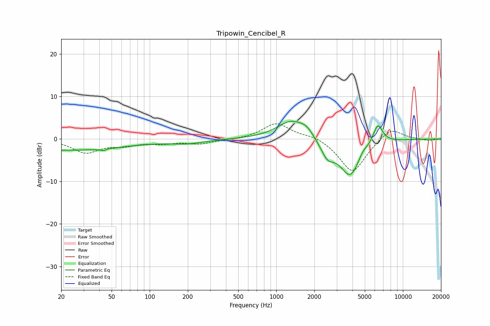

# Tripowin_Cencibel_R
See [usage instructions](https://github.com/jaakkopasanen/AutoEq#usage) for more options and info.

### Parametric EQs
Apply preamp of -4.3 dB when using parametric equalizer.

|   # | Type    |   Fc (Hz) |    Q |   Gain (dB) |
|-----|---------|-----------|------|-------------|
|   1 | Peaking |        20 | 0.26 |        -2.7 |
|   2 | Peaking |        45 | 5.34 |        -2.4 |
|   3 | Peaking |        46 | 5.97 |         2.1 |
|   4 | Peaking |       200 | 1.01 |        -0.9 |
|   5 | Peaking |      1333 | 1.22 |         4.6 |
|   6 | Peaking |      1739 | 3.05 |         1.4 |
|   7 | Peaking |      2535 | 2.78 |        -3.4 |
|   8 | Peaking |      3842 | 1.61 |        -9   |
|   9 | Peaking |      4793 | 3.57 |         1.4 |
|  10 | Peaking |      6333 | 3.46 |         4.9 |

### Fixed Band EQs
When using fixed band (also called graphic) equalizer, apply preamp of **-3.7 dB** (if available) and set gains manually with these parameters.

|   # | Type    |   Fc (Hz) |    Q |   Gain (dB) |
|-----|---------|-----------|------|-------------|
|   1 | Peaking |        31 | 1.41 |        -3.1 |
|   2 | Peaking |        62 | 1.41 |        -1.2 |
|   3 | Peaking |       125 | 1.41 |        -0.8 |
|   4 | Peaking |       250 | 1.41 |        -1.1 |
|   5 | Peaking |       500 | 1.41 |        -0.1 |
|   6 | Peaking |      1000 | 1.41 |         3.7 |
|   7 | Peaking |      2000 | 1.41 |         0.9 |
|   8 | Peaking |      4000 | 1.41 |        -8.1 |
|   9 | Peaking |      8000 | 1.41 |         3   |
|  10 | Peaking |     16000 | 1.41 |        -0.4 |

### Graphs

