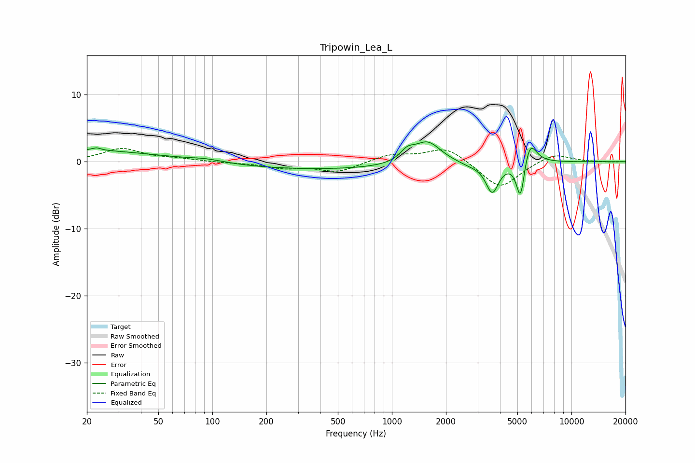

# Tripowin_Lea_L
See [usage instructions](https://github.com/jaakkopasanen/AutoEq#usage) for more options and info.

### Parametric EQs
Apply preamp of -3.1 dB when using parametric equalizer.

|   # | Type    |   Fc (Hz) |    Q |   Gain (dB) |
|-----|---------|-----------|------|-------------|
|   1 | Peaking |        20 | 0.36 |         1.7 |
|   2 | Peaking |        23 | 5.94 |         0.4 |
|   3 | Peaking |        92 | 1.41 |         0.4 |
|   4 | Peaking |       405 | 0.27 |        -1.1 |
|   5 | Peaking |      1218 | 3.54 |         1.4 |
|   6 | Peaking |      1578 | 1.89 |         3.3 |
|   7 | Peaking |      2717 | 2.26 |        -0.5 |
|   8 | Peaking |      3622 | 3.9  |        -4.5 |
|   9 | Peaking |      5203 | 6    |        -6.2 |
|  10 | Peaking |      5846 | 3.78 |         3.8 |

### Fixed Band EQs
When using fixed band (also called graphic) equalizer, apply preamp of **-2.1 dB** (if available) and set gains manually with these parameters.

|   # | Type    |   Fc (Hz) |    Q |   Gain (dB) |
|-----|---------|-----------|------|-------------|
|   1 | Peaking |        31 | 1.41 |         1.9 |
|   2 | Peaking |        62 | 1.41 |         0.4 |
|   3 | Peaking |       125 | 1.41 |        -0.1 |
|   4 | Peaking |       250 | 1.41 |        -0.9 |
|   5 | Peaking |       500 | 1.41 |        -1.5 |
|   6 | Peaking |      1000 | 1.41 |         1.1 |
|   7 | Peaking |      2000 | 1.41 |         2.3 |
|   8 | Peaking |      4000 | 1.41 |        -4.1 |
|   9 | Peaking |      8000 | 1.41 |         1.4 |
|  10 | Peaking |     16000 | 1.41 |        -0   |

### Graphs

