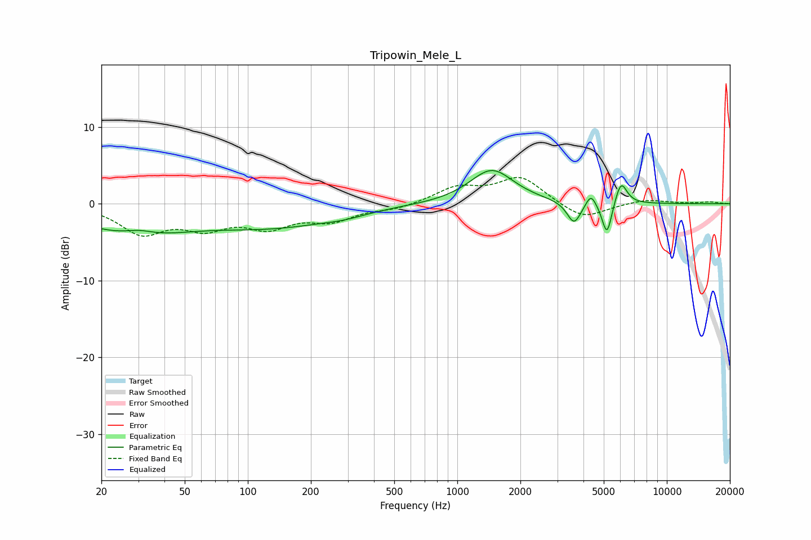

# Tripowin_Mele_L
See [usage instructions](https://github.com/jaakkopasanen/AutoEq#usage) for more options and info.

### Parametric EQs
Apply preamp of -4.4 dB when using parametric equalizer.

|   # | Type    |   Fc (Hz) |    Q |   Gain (dB) |
|-----|---------|-----------|------|-------------|
|   1 | Peaking |        29 | 0.53 |        -3.7 |
|   2 | Peaking |        30 | 2.06 |         0.7 |
|   3 | Peaking |       135 | 0.47 |        -2.6 |
|   4 | Peaking |       288 | 1.34 |        -0.5 |
|   5 | Peaking |      1460 | 1.35 |         4.5 |
|   6 | Peaking |      3607 | 4.27 |        -2.9 |
|   7 | Peaking |      4342 | 6    |         1.7 |
|   8 | Peaking |      5180 | 6    |        -3.5 |
|   9 | Peaking |      5184 | 6    |        -1   |
|  10 | Peaking |      6044 | 4.91 |         3.1 |

### Fixed Band EQs
When using fixed band (also called graphic) equalizer, apply preamp of **-3.5 dB** (if available) and set gains manually with these parameters.

|   # | Type    |   Fc (Hz) |    Q |   Gain (dB) |
|-----|---------|-----------|------|-------------|
|   1 | Peaking |        31 | 1.41 |        -3.6 |
|   2 | Peaking |        62 | 1.41 |        -2.6 |
|   3 | Peaking |       125 | 1.41 |        -2.7 |
|   4 | Peaking |       250 | 1.41 |        -1.9 |
|   5 | Peaking |       500 | 1.41 |        -0.6 |
|   6 | Peaking |      1000 | 1.41 |         2   |
|   7 | Peaking |      2000 | 1.41 |         3.4 |
|   8 | Peaking |      4000 | 1.41 |        -2.1 |
|   9 | Peaking |      8000 | 1.41 |         0.6 |
|  10 | Peaking |     16000 | 1.41 |         0.2 |

### Graphs

