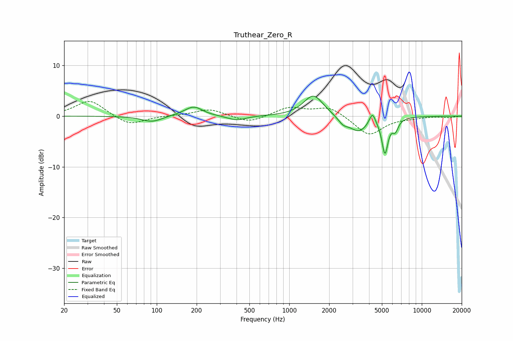

# Truthear_Zero_R
See [usage instructions](https://github.com/jaakkopasanen/AutoEq#usage) for more options and info.

### Parametric EQs
Apply preamp of -4.0 dB when using parametric equalizer.

|   # | Type    |   Fc (Hz) |    Q |   Gain (dB) |
|-----|---------|-----------|------|-------------|
|   1 | Peaking |        92 | 1.87 |        -1.2 |
|   2 | Peaking |       170 | 1.55 |         0.4 |
|   3 | Peaking |       191 | 2.26 |         1.6 |
|   4 | Peaking |       401 | 2.08 |        -0.9 |
|   5 | Peaking |      1522 | 1.92 |         4.3 |
|   6 | Peaking |      2547 | 3.78 |        -1.2 |
|   7 | Peaking |      3338 | 1.96 |        -3   |
|   8 | Peaking |      4239 | 6    |         2.4 |
|   9 | Peaking |      5269 | 6    |        -6.8 |
|  10 | Peaking |      6315 | 6    |        -2.1 |

### Fixed Band EQs
When using fixed band (also called graphic) equalizer, apply preamp of **-3.0 dB** (if available) and set gains manually with these parameters.

|   # | Type    |   Fc (Hz) |    Q |   Gain (dB) |
|-----|---------|-----------|------|-------------|
|   1 | Peaking |        31 | 1.41 |         3.2 |
|   2 | Peaking |        62 | 1.41 |        -1.9 |
|   3 | Peaking |       125 | 1.41 |         0.1 |
|   4 | Peaking |       250 | 1.41 |         1.4 |
|   5 | Peaking |       500 | 1.41 |        -1.4 |
|   6 | Peaking |      1000 | 1.41 |         1.7 |
|   7 | Peaking |      2000 | 1.41 |         1.9 |
|   8 | Peaking |      4000 | 1.41 |        -3.8 |
|   9 | Peaking |      8000 | 1.41 |        -0.3 |
|  10 | Peaking |     16000 | 1.41 |        -0.3 |

### Graphs

