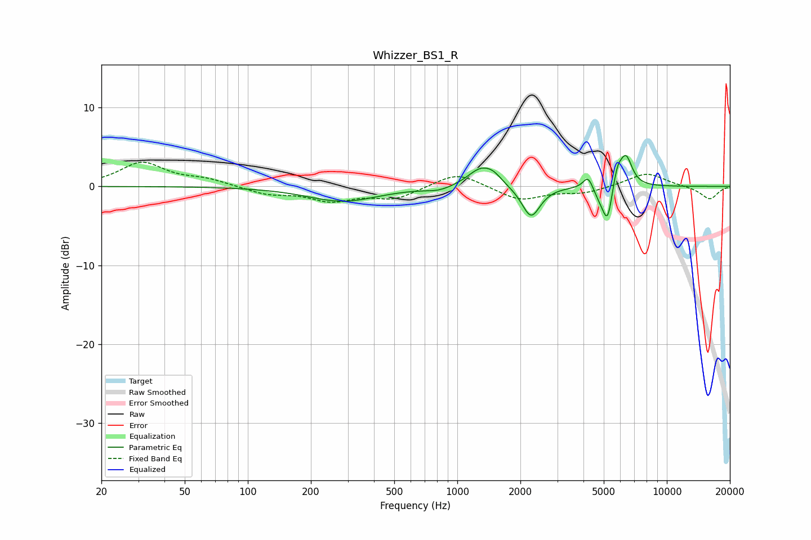

# Whizzer_BS1_R
See [usage instructions](https://github.com/jaakkopasanen/AutoEq#usage) for more options and info.

### Parametric EQs
Apply preamp of -4.0 dB when using parametric equalizer.

|   # | Type    |   Fc (Hz) |    Q |   Gain (dB) |
|-----|---------|-----------|------|-------------|
|   1 | Peaking |       284 | 0.84 |        -1.9 |
|   2 | Peaking |       815 | 2.28 |        -0.5 |
|   3 | Peaking |      1295 | 2.21 |         2.3 |
|   4 | Peaking |      1490 | 3.43 |         0.9 |
|   5 | Peaking |      2248 | 3.23 |        -4   |
|   6 | Peaking |      4209 | 6    |         1.7 |
|   7 | Peaking |      4773 | 4.73 |        -1.2 |
|   8 | Peaking |      5215 | 6    |        -4.6 |
|   9 | Peaking |      5805 | 6    |         2.3 |
|  10 | Peaking |      6390 | 4.71 |         3.7 |

### Fixed Band EQs
When using fixed band (also called graphic) equalizer, apply preamp of **-3.2 dB** (if available) and set gains manually with these parameters.

|   # | Type    |   Fc (Hz) |    Q |   Gain (dB) |
|-----|---------|-----------|------|-------------|
|   1 | Peaking |        31 | 1.41 |         3   |
|   2 | Peaking |        62 | 1.41 |         0.8 |
|   3 | Peaking |       125 | 1.41 |        -0.9 |
|   4 | Peaking |       250 | 1.41 |        -1.7 |
|   5 | Peaking |       500 | 1.41 |        -1.5 |
|   6 | Peaking |      1000 | 1.41 |         1.9 |
|   7 | Peaking |      2000 | 1.41 |        -1.8 |
|   8 | Peaking |      4000 | 1.41 |        -0.8 |
|   9 | Peaking |      8000 | 1.41 |         1.8 |
|  10 | Peaking |     16000 | 1.41 |        -1.6 |

### Graphs

