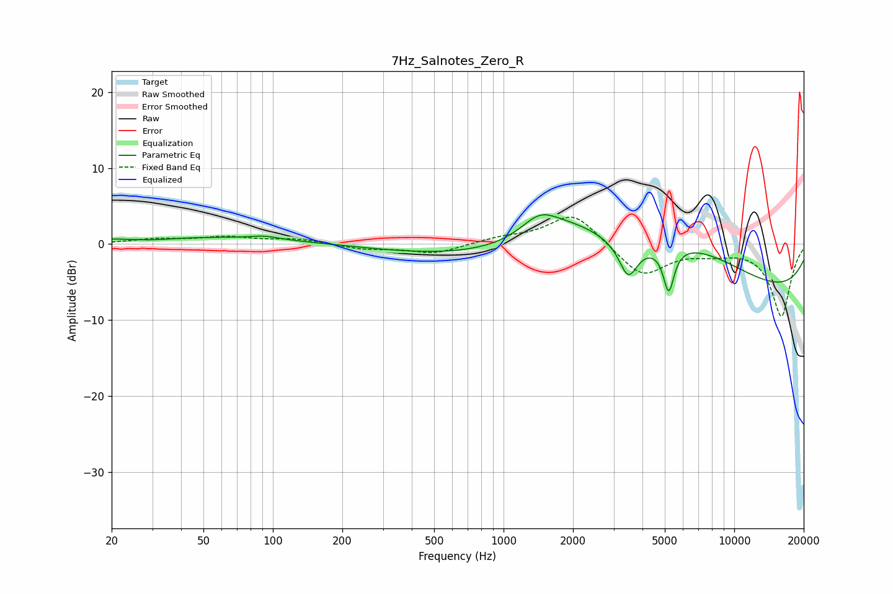

# 7Hz_Salnotes_Zero_R
See [usage instructions](https://github.com/jaakkopasanen/AutoEq#usage) for more options and info.

### Parametric EQs
Apply preamp of -3.9 dB when using parametric equalizer.

|   # | Type    |   Fc (Hz) |    Q |   Gain (dB) |
|-----|---------|-----------|------|-------------|
|   1 | Peaking |        30 | 1.44 |        -0.4 |
|   2 | Peaking |        41 | 0.28 |         1   |
|   3 | Peaking |        92 | 2.38 |         0.4 |
|   4 | Peaking |      1016 | 0.28 |        -1.9 |
|   5 | Peaking |      1432 | 1.77 |         2.7 |
|   6 | Peaking |      2012 | 0.67 |         5.6 |
|   7 | Peaking |      3470 | 3.58 |        -4.5 |
|   8 | Peaking |      5199 | 6    |        -5.8 |
|   9 | Peaking |      6383 | 0.51 |         6   |
|  10 | Peaking |      9385 | 0.18 |        -7.3 |

### Fixed Band EQs
When using fixed band (also called graphic) equalizer, apply preamp of **-3.6 dB** (if available) and set gains manually with these parameters.

|   # | Type    |   Fc (Hz) |    Q |   Gain (dB) |
|-----|---------|-----------|------|-------------|
|   1 | Peaking |        31 | 1.41 |         0.6 |
|   2 | Peaking |        62 | 1.41 |         0.8 |
|   3 | Peaking |       125 | 1.41 |         0.6 |
|   4 | Peaking |       250 | 1.41 |        -0.6 |
|   5 | Peaking |       500 | 1.41 |        -1.3 |
|   6 | Peaking |      1000 | 1.41 |         0.7 |
|   7 | Peaking |      2000 | 1.41 |         4.2 |
|   8 | Peaking |      4000 | 1.41 |        -4.3 |
|   9 | Peaking |      8000 | 1.41 |        -0.9 |
|  10 | Peaking |     16000 | 1.41 |        -9.5 |

### Graphs

