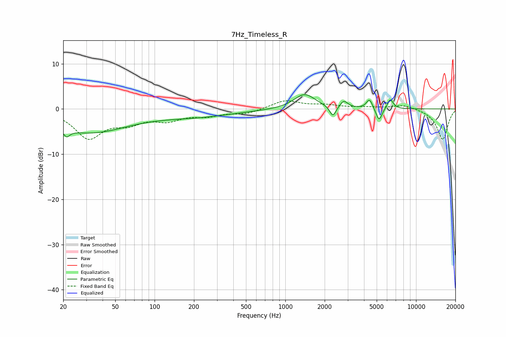

# 7Hz_Timeless_R
See [usage instructions](https://github.com/jaakkopasanen/AutoEq#usage) for more options and info.

### Parametric EQs
Apply preamp of -3.3 dB when using parametric equalizer.

|   # | Type    |   Fc (Hz) |    Q |   Gain (dB) |
|-----|---------|-----------|------|-------------|
|   1 | Peaking |        21 | 5.99 |         3.2 |
|   2 | Peaking |        21 | 5.88 |        -4.9 |
|   3 | Peaking |        31 | 0.48 |        -5.1 |
|   4 | Peaking |       207 | 0.48 |        -1.5 |
|   5 | Peaking |      1406 | 1.74 |         3.3 |
|   6 | Peaking |      2311 | 5.94 |        -2.4 |
|   7 | Peaking |      2803 | 4.84 |         1.6 |
|   8 | Peaking |      4406 | 6    |         2.2 |
|   9 | Peaking |      5210 | 5.96 |        -2.9 |
|  10 | Peaking |      6352 | 6    |         2.2 |

### Fixed Band EQs
When using fixed band (also called graphic) equalizer, apply preamp of **-1.9 dB** (if available) and set gains manually with these parameters.

|   # | Type    |   Fc (Hz) |    Q |   Gain (dB) |
|-----|---------|-----------|------|-------------|
|   1 | Peaking |        31 | 1.41 |        -6.2 |
|   2 | Peaking |        62 | 1.41 |        -2.5 |
|   3 | Peaking |       125 | 1.41 |        -2.1 |
|   4 | Peaking |       250 | 1.41 |        -1.3 |
|   5 | Peaking |       500 | 1.41 |        -1   |
|   6 | Peaking |      1000 | 1.41 |         1.9 |
|   7 | Peaking |      2000 | 1.41 |         0.7 |
|   8 | Peaking |      4000 | 1.41 |         0.3 |
|   9 | Peaking |      8000 | 1.41 |         1   |
|  10 | Peaking |     16000 | 1.41 |        -6.8 |

### Graphs

