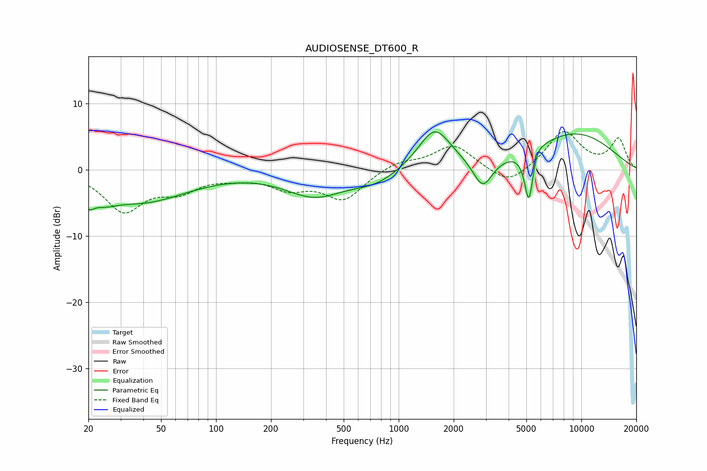

# AUDIOSENSE_DT600_R
See [usage instructions](https://github.com/jaakkopasanen/AutoEq#usage) for more options and info.

### Parametric EQs
Apply preamp of -5.8 dB when using parametric equalizer.

|   # | Type    |   Fc (Hz) |    Q |   Gain (dB) |
|-----|---------|-----------|------|-------------|
|   1 | Peaking |        20 | 4.55 |        -2.1 |
|   2 | Peaking |        24 | 1.98 |        -1.6 |
|   3 | Peaking |        39 | 0.56 |        -4.7 |
|   4 | Peaking |       346 | 0.88 |        -3.7 |
|   5 | Peaking |       749 | 1.1  |        -1.8 |
|   6 | Peaking |      1572 | 1.56 |         6.3 |
|   7 | Peaking |      2887 | 2.65 |        -4.5 |
|   8 | Peaking |      5164 | 5.81 |        -8.2 |
|   9 | Peaking |      5701 | 4.77 |         1.1 |
|  10 | Peaking |      9064 | 0.5  |         5.5 |

### Fixed Band EQs
When using fixed band (also called graphic) equalizer, apply preamp of **-5.9 dB** (if available) and set gains manually with these parameters.

|   # | Type    |   Fc (Hz) |    Q |   Gain (dB) |
|-----|---------|-----------|------|-------------|
|   1 | Peaking |        31 | 1.41 |        -6   |
|   2 | Peaking |        62 | 1.41 |        -2.7 |
|   3 | Peaking |       125 | 1.41 |        -0.8 |
|   4 | Peaking |       250 | 1.41 |        -2.4 |
|   5 | Peaking |       500 | 1.41 |        -4.4 |
|   6 | Peaking |      1000 | 1.41 |         1.3 |
|   7 | Peaking |      2000 | 1.41 |         3.8 |
|   8 | Peaking |      4000 | 1.41 |        -2.7 |
|   9 | Peaking |      8000 | 1.41 |         5.8 |
|  10 | Peaking |     16000 | 1.41 |         4.5 |

### Graphs

