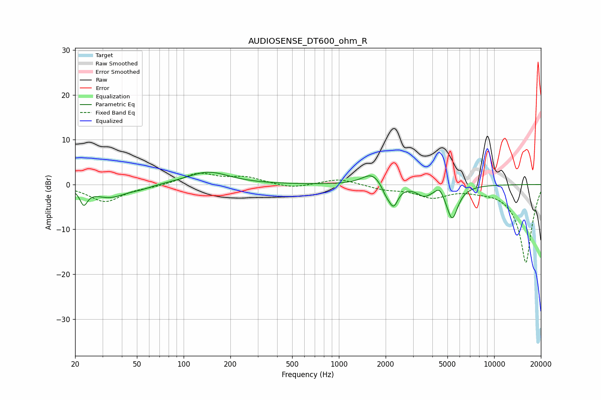

# AUDIOSENSE_DT600_ohm_R
See [usage instructions](https://github.com/jaakkopasanen/AutoEq#usage) for more options and info.

### Parametric EQs
Apply preamp of -2.8 dB when using parametric equalizer.

|   # | Type    |   Fc (Hz) |    Q |   Gain (dB) |
|-----|---------|-----------|------|-------------|
|   1 | Peaking |        23 | 5.97 |        -3.4 |
|   2 | Peaking |        33 | 1.34 |        -2.8 |
|   3 | Peaking |        53 | 2.02 |        -0.6 |
|   4 | Peaking |       144 | 1.04 |         2.8 |
|   5 | Peaking |      1635 | 2.25 |         2.7 |
|   6 | Peaking |      2008 | 5.07 |        -1.7 |
|   7 | Peaking |      2246 | 4.66 |        -4.6 |
|   8 | Peaking |      3545 | 2.94 |        -2.1 |
|   9 | Peaking |      4455 | 5.34 |         1.7 |
|  10 | Peaking |      5363 | 3.69 |        -7.5 |

### Fixed Band EQs
When using fixed band (also called graphic) equalizer, apply preamp of **-2.6 dB** (if available) and set gains manually with these parameters.

|   # | Type    |   Fc (Hz) |    Q |   Gain (dB) |
|-----|---------|-----------|------|-------------|
|   1 | Peaking |        31 | 1.41 |        -3.8 |
|   2 | Peaking |        62 | 1.41 |        -0.4 |
|   3 | Peaking |       125 | 1.41 |         2.5 |
|   4 | Peaking |       250 | 1.41 |         1.5 |
|   5 | Peaking |       500 | 1.41 |        -0.9 |
|   6 | Peaking |      1000 | 1.41 |         1.4 |
|   7 | Peaking |      2000 | 1.41 |        -1   |
|   8 | Peaking |      4000 | 1.41 |        -2.6 |
|   9 | Peaking |      8000 | 1.41 |        -0.6 |
|  10 | Peaking |     16000 | 1.41 |       -17.5 |

### Graphs

