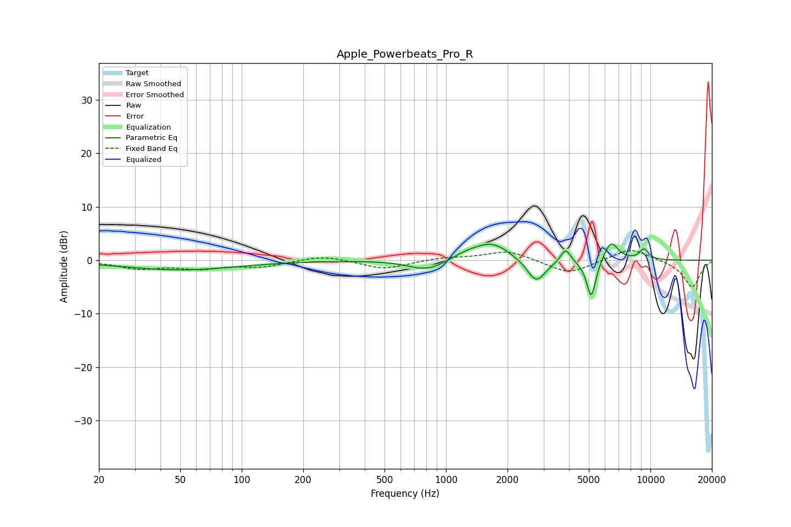

# Apple_Powerbeats_Pro_R
See [usage instructions](https://github.com/jaakkopasanen/AutoEq#usage) for more options and info.

### Parametric EQs
Apply preamp of -3.1 dB when using parametric equalizer.

|   # | Type    |   Fc (Hz) |    Q |   Gain (dB) |
|-----|---------|-----------|------|-------------|
|   1 | Peaking |        50 | 0.51 |        -1.8 |
|   2 | Peaking |       781 | 1.68 |        -1.5 |
|   3 | Peaking |       919 | 1.53 |        -0.8 |
|   4 | Peaking |      1257 | 1.57 |         1.3 |
|   5 | Peaking |      1691 | 1.66 |         3   |
|   6 | Peaking |      2765 | 3.08 |        -4.4 |
|   7 | Peaking |      3843 | 5.96 |         2.6 |
|   8 | Peaking |      5136 | 6    |        -7.4 |
|   9 | Peaking |      6410 | 3.89 |         3.7 |
|  10 | Peaking |      9306 | 5.58 |         2   |

### Fixed Band EQs
When using fixed band (also called graphic) equalizer, apply preamp of **-1.9 dB** (if available) and set gains manually with these parameters.

|   # | Type    |   Fc (Hz) |    Q |   Gain (dB) |
|-----|---------|-----------|------|-------------|
|   1 | Peaking |        31 | 1.41 |        -1.4 |
|   2 | Peaking |        62 | 1.41 |        -1.3 |
|   3 | Peaking |       125 | 1.41 |        -1.1 |
|   4 | Peaking |       250 | 1.41 |         1   |
|   5 | Peaking |       500 | 1.41 |        -1.7 |
|   6 | Peaking |      1000 | 1.41 |         0.5 |
|   7 | Peaking |      2000 | 1.41 |         1.8 |
|   8 | Peaking |      4000 | 1.41 |        -2.6 |
|   9 | Peaking |      8000 | 1.41 |         2.4 |
|  10 | Peaking |     16000 | 1.41 |        -5.1 |

### Graphs

