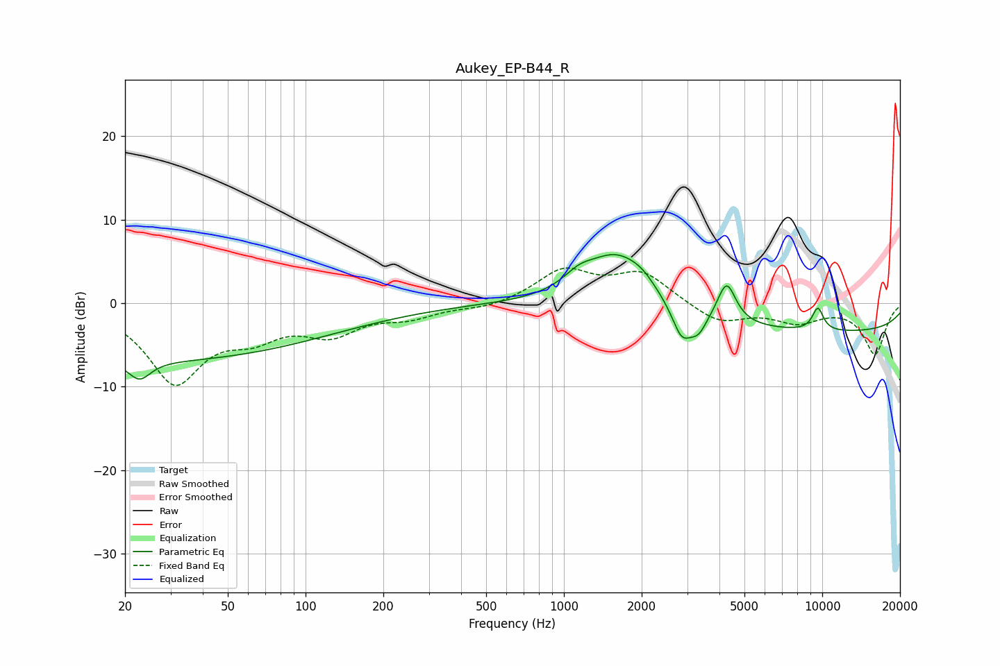

# Aukey_EP-B44_R
See [usage instructions](https://github.com/jaakkopasanen/AutoEq#usage) for more options and info.

### Parametric EQs
Apply preamp of -5.9 dB when using parametric equalizer.

|   # | Type    |   Fc (Hz) |    Q |   Gain (dB) |
|-----|---------|-----------|------|-------------|
|   1 | Peaking |        23 | 3.38 |        -2.2 |
|   2 | Peaking |        25 | 0.18 |        -6.8 |
|   3 | Peaking |      1143 | 2.36 |         1.6 |
|   4 | Peaking |      1604 | 1.15 |         6.4 |
|   5 | Peaking |      2016 | 2.63 |         1.1 |
|   6 | Peaking |      2858 | 3.77 |        -3.7 |
|   7 | Peaking |      3314 | 4.17 |        -2.2 |
|   8 | Peaking |      4264 | 3.94 |         4.8 |
|   9 | Peaking |      9615 | 5.64 |         2.7 |
|  10 | Peaking |     10000 | 0.18 |        -3.5 |

### Fixed Band EQs
When using fixed band (also called graphic) equalizer, apply preamp of **-4.3 dB** (if available) and set gains manually with these parameters.

|   # | Type    |   Fc (Hz) |    Q |   Gain (dB) |
|-----|---------|-----------|------|-------------|
|   1 | Peaking |        31 | 1.41 |        -9.2 |
|   2 | Peaking |        62 | 1.41 |        -2.9 |
|   3 | Peaking |       125 | 1.41 |        -3.2 |
|   4 | Peaking |       250 | 1.41 |        -1.4 |
|   5 | Peaking |       500 | 1.41 |        -0.6 |
|   6 | Peaking |      1000 | 1.41 |         3.8 |
|   7 | Peaking |      2000 | 1.41 |         3.5 |
|   8 | Peaking |      4000 | 1.41 |        -2.4 |
|   9 | Peaking |      8000 | 1.41 |        -2   |
|  10 | Peaking |     16000 | 1.41 |        -6   |

### Graphs

