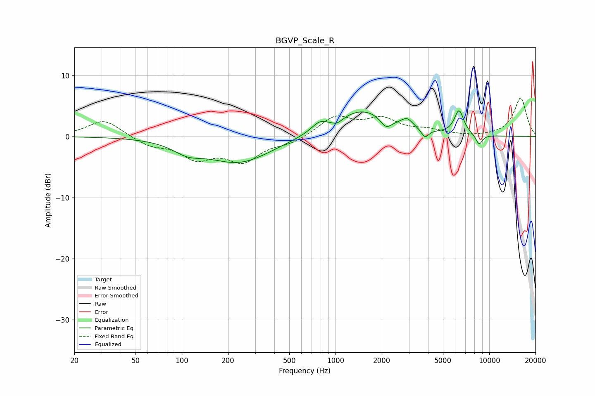

# BGVP_Scale_R
See [usage instructions](https://github.com/jaakkopasanen/AutoEq#usage) for more options and info.

### Parametric EQs
Apply preamp of -4.3 dB when using parametric equalizer.

|   # | Type    |   Fc (Hz) |    Q |   Gain (dB) |
|-----|---------|-----------|------|-------------|
|   1 | Peaking |       109 | 1.54 |        -1.6 |
|   2 | Peaking |       236 | 0.67 |        -4.3 |
|   3 | Peaking |       785 | 2.8  |         1.3 |
|   4 | Peaking |      1022 | 3.73 |        -0.9 |
|   5 | Peaking |      1500 | 0.75 |         4.4 |
|   6 | Peaking |      2132 | 3.71 |        -1.8 |
|   7 | Peaking |      2919 | 3.93 |         1.3 |
|   8 | Peaking |      3819 | 5.75 |        -1.5 |
|   9 | Peaking |      6365 | 4.47 |         3.9 |
|  10 | Peaking |      8593 | 5.77 |        -1.7 |

### Fixed Band EQs
When using fixed band (also called graphic) equalizer, apply preamp of **-6.4 dB** (if available) and set gains manually with these parameters.

|   # | Type    |   Fc (Hz) |    Q |   Gain (dB) |
|-----|---------|-----------|------|-------------|
|   1 | Peaking |        31 | 1.41 |         2.8 |
|   2 | Peaking |        62 | 1.41 |        -1.4 |
|   3 | Peaking |       125 | 1.41 |        -3.3 |
|   4 | Peaking |       250 | 1.41 |        -3.7 |
|   5 | Peaking |       500 | 1.41 |        -1   |
|   6 | Peaking |      1000 | 1.41 |         3.2 |
|   7 | Peaking |      2000 | 1.41 |         2.6 |
|   8 | Peaking |      4000 | 1.41 |         0.9 |
|   9 | Peaking |      8000 | 1.41 |        -0.1 |
|  10 | Peaking |     16000 | 1.41 |         6.3 |

### Graphs

