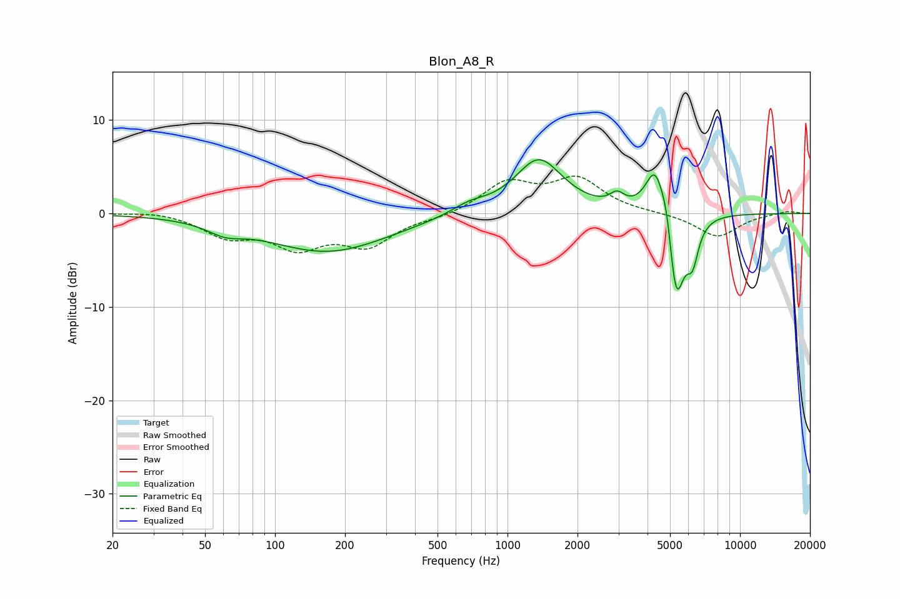

# Blon_A8_R
See [usage instructions](https://github.com/jaakkopasanen/AutoEq#usage) for more options and info.

### Parametric EQs
Apply preamp of -5.8 dB when using parametric equalizer.

|   # | Type    |   Fc (Hz) |    Q |   Gain (dB) |
|-----|---------|-----------|------|-------------|
|   1 | Peaking |        61 | 1.92 |        -1   |
|   2 | Peaking |       168 | 0.54 |        -4.1 |
|   3 | Peaking |       685 | 1.75 |         1   |
|   4 | Peaking |      1363 | 1.38 |         5.8 |
|   5 | Peaking |      2961 | 4.58 |         1.2 |
|   6 | Peaking |      4324 | 3.32 |         5.6 |
|   7 | Peaking |      4853 | 6    |         2.5 |
|   8 | Peaking |      5247 | 6    |        -1.9 |
|   9 | Peaking |      5340 | 3.64 |        -8.2 |
|  10 | Peaking |      6250 | 5.36 |        -3.8 |

### Fixed Band EQs
When using fixed band (also called graphic) equalizer, apply preamp of **-4.1 dB** (if available) and set gains manually with these parameters.

|   # | Type    |   Fc (Hz) |    Q |   Gain (dB) |
|-----|---------|-----------|------|-------------|
|   1 | Peaking |        31 | 1.41 |         0.3 |
|   2 | Peaking |        62 | 1.41 |        -2.2 |
|   3 | Peaking |       125 | 1.41 |        -3.2 |
|   4 | Peaking |       250 | 1.41 |        -3.2 |
|   5 | Peaking |       500 | 1.41 |        -0.4 |
|   6 | Peaking |      1000 | 1.41 |         3.2 |
|   7 | Peaking |      2000 | 1.41 |         3.5 |
|   8 | Peaking |      4000 | 1.41 |         0   |
|   9 | Peaking |      8000 | 1.41 |        -2.5 |
|  10 | Peaking |     16000 | 1.41 |         0.3 |

### Graphs

