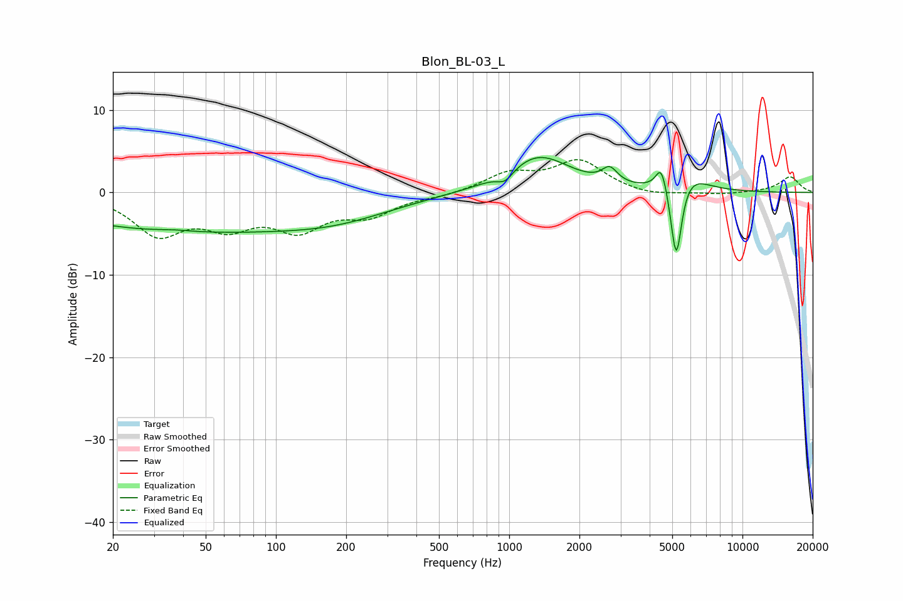

# Blon_BL-03_L
See [usage instructions](https://github.com/jaakkopasanen/AutoEq#usage) for more options and info.

### Parametric EQs
Apply preamp of -4.3 dB when using parametric equalizer.

|   # | Type    |   Fc (Hz) |    Q |   Gain (dB) |
|-----|---------|-----------|------|-------------|
|   1 | Peaking |        37 | 2    |         0.2 |
|   2 | Peaking |        38 | 0.26 |        -4.5 |
|   3 | Peaking |       186 | 0.56 |        -2.2 |
|   4 | Peaking |       961 | 4.14 |        -1.3 |
|   5 | Peaking |      1332 | 1.03 |         4.5 |
|   6 | Peaking |      2698 | 4.33 |         1.8 |
|   7 | Peaking |      4491 | 5.96 |         3   |
|   8 | Peaking |      5200 | 5.97 |        -7.6 |
|   9 | Peaking |      5207 | 5.99 |        -2.2 |
|  10 | Peaking |      5861 | 1.81 |         2.1 |

### Fixed Band EQs
When using fixed band (also called graphic) equalizer, apply preamp of **-4.1 dB** (if available) and set gains manually with these parameters.

|   # | Type    |   Fc (Hz) |    Q |   Gain (dB) |
|-----|---------|-----------|------|-------------|
|   1 | Peaking |        31 | 1.41 |        -4.8 |
|   2 | Peaking |        62 | 1.41 |        -3.4 |
|   3 | Peaking |       125 | 1.41 |        -4   |
|   4 | Peaking |       250 | 1.41 |        -2.4 |
|   5 | Peaking |       500 | 1.41 |        -0.4 |
|   6 | Peaking |      1000 | 1.41 |         2.2 |
|   7 | Peaking |      2000 | 1.41 |         3.7 |
|   8 | Peaking |      4000 | 1.41 |        -0.5 |
|   9 | Peaking |      8000 | 1.41 |        -0.3 |
|  10 | Peaking |     16000 | 1.41 |         1.9 |

### Graphs

