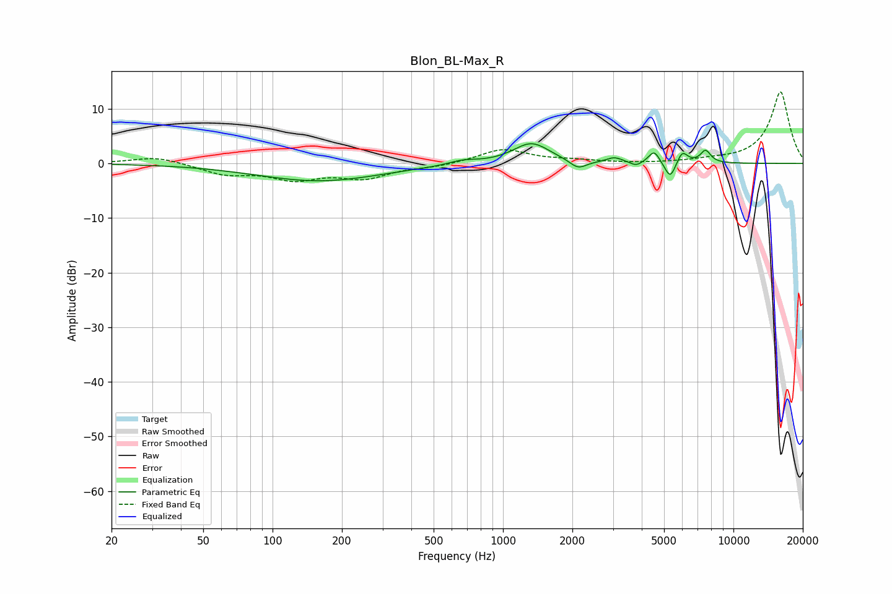

# Blon_BL-Max_R
See [usage instructions](https://github.com/jaakkopasanen/AutoEq#usage) for more options and info.

### Parametric EQs
Apply preamp of -3.7 dB when using parametric equalizer.

|   # | Type    |   Fc (Hz) |    Q |   Gain (dB) |
|-----|---------|-----------|------|-------------|
|   1 | Peaking |       159 | 0.52 |        -3.2 |
|   2 | Peaking |       668 | 2.27 |         0.8 |
|   3 | Peaking |      1328 | 1.77 |         3.8 |
|   4 | Peaking |      2119 | 3.86 |        -1.6 |
|   5 | Peaking |      3044 | 4.14 |         0.9 |
|   6 | Peaking |      3783 | 5.8  |        -0.8 |
|   7 | Peaking |      4527 | 5.99 |         2.3 |
|   8 | Peaking |      5321 | 6    |        -3.2 |
|   9 | Peaking |      5994 | 5.98 |         2.3 |
|  10 | Peaking |      7569 | 5.96 |         2.3 |

### Fixed Band EQs
When using fixed band (also called graphic) equalizer, apply preamp of **-13.2 dB** (if available) and set gains manually with these parameters.

|   # | Type    |   Fc (Hz) |    Q |   Gain (dB) |
|-----|---------|-----------|------|-------------|
|   1 | Peaking |        31 | 1.41 |         1.3 |
|   2 | Peaking |        62 | 1.41 |        -1.8 |
|   3 | Peaking |       125 | 1.41 |        -2.6 |
|   4 | Peaking |       250 | 1.41 |        -2.4 |
|   5 | Peaking |       500 | 1.41 |        -0.5 |
|   6 | Peaking |      1000 | 1.41 |         2.6 |
|   7 | Peaking |      2000 | 1.41 |         0.5 |
|   8 | Peaking |      4000 | 1.41 |        -0.1 |
|   9 | Peaking |      8000 | 1.41 |         0.4 |
|  10 | Peaking |     16000 | 1.41 |        13.2 |

### Graphs

