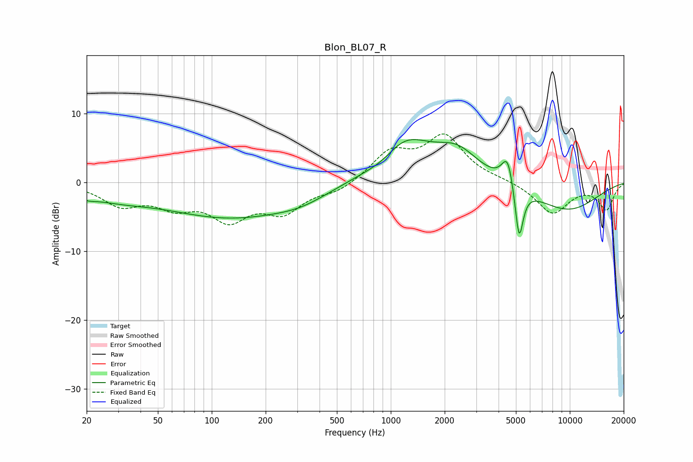

# Blon_BL07_R
See [usage instructions](https://github.com/jaakkopasanen/AutoEq#usage) for more options and info.

### Parametric EQs
Apply preamp of -6.3 dB when using parametric equalizer.

|   # | Type    |   Fc (Hz) |    Q |   Gain (dB) |
|-----|---------|-----------|------|-------------|
|   1 | Peaking |        20 | 3.03 |        -0.7 |
|   2 | Peaking |        29 | 0.77 |        -1.6 |
|   3 | Peaking |       128 | 0.38 |        -4.9 |
|   4 | Peaking |       315 | 0.96 |        -1.1 |
|   5 | Peaking |       924 | 1.37 |        -1.8 |
|   6 | Peaking |      1164 | 0.9  |         6.8 |
|   7 | Peaking |      2364 | 1.17 |         3.8 |
|   8 | Peaking |      4501 | 4.21 |         4.5 |
|   9 | Peaking |      5208 | 6    |        -8.2 |
|  10 | Peaking |      9632 | 0.65 |        -4   |

### Fixed Band EQs
When using fixed band (also called graphic) equalizer, apply preamp of **-7.2 dB** (if available) and set gains manually with these parameters.

|   # | Type    |   Fc (Hz) |    Q |   Gain (dB) |
|-----|---------|-----------|------|-------------|
|   1 | Peaking |        31 | 1.41 |        -3   |
|   2 | Peaking |        62 | 1.41 |        -2.9 |
|   3 | Peaking |       125 | 1.41 |        -4.8 |
|   4 | Peaking |       250 | 1.41 |        -3.9 |
|   5 | Peaking |       500 | 1.41 |        -1.3 |
|   6 | Peaking |      1000 | 1.41 |         4.2 |
|   7 | Peaking |      2000 | 1.41 |         6.5 |
|   8 | Peaking |      4000 | 1.41 |         0.3 |
|   9 | Peaking |      8000 | 1.41 |        -4.5 |
|  10 | Peaking |     16000 | 1.41 |        -3.8 |

### Graphs

