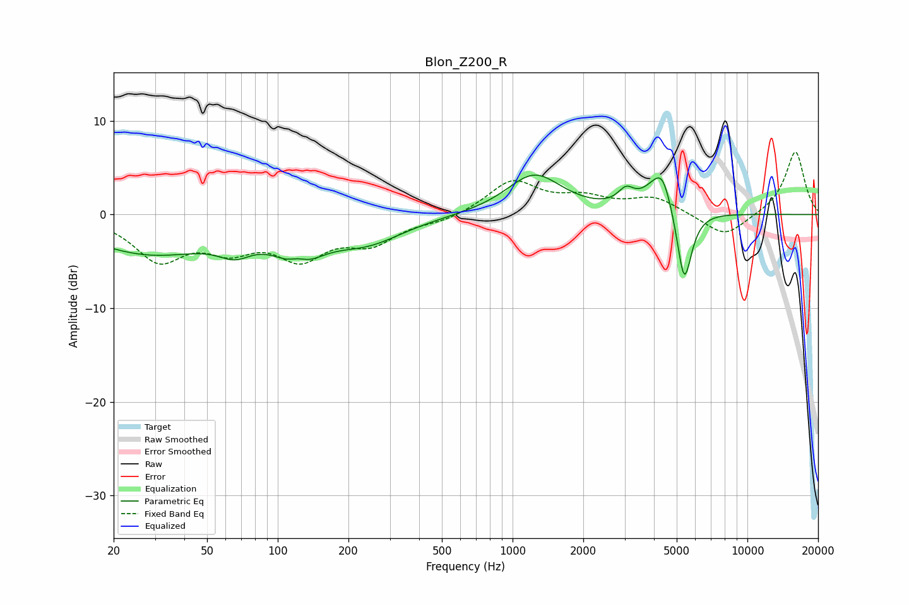

# Blon_Z200_R
See [usage instructions](https://github.com/jaakkopasanen/AutoEq#usage) for more options and info.

### Parametric EQs
Apply preamp of -4.3 dB when using parametric equalizer.

|   # | Type    |   Fc (Hz) |    Q |   Gain (dB) |
|-----|---------|-----------|------|-------------|
|   1 | Peaking |        29 | 0.52 |        -4.1 |
|   2 | Peaking |        66 | 1.99 |        -1.8 |
|   3 | Peaking |       122 | 2.91 |         1.9 |
|   4 | Peaking |       122 | 1.67 |        -4.6 |
|   5 | Peaking |       238 | 0.88 |        -2.7 |
|   6 | Peaking |      1237 | 1.2  |         4.3 |
|   7 | Peaking |      3039 | 4.2  |         1.5 |
|   8 | Peaking |      4255 | 2.15 |         3.8 |
|   9 | Peaking |      4351 | 4.5  |         1.3 |
|  10 | Peaking |      5380 | 4.26 |        -8.5 |

### Fixed Band EQs
When using fixed band (also called graphic) equalizer, apply preamp of **-6.8 dB** (if available) and set gains manually with these parameters.

|   # | Type    |   Fc (Hz) |    Q |   Gain (dB) |
|-----|---------|-----------|------|-------------|
|   1 | Peaking |        31 | 1.41 |        -4.6 |
|   2 | Peaking |        62 | 1.41 |        -3   |
|   3 | Peaking |       125 | 1.41 |        -4.1 |
|   4 | Peaking |       250 | 1.41 |        -2.7 |
|   5 | Peaking |       500 | 1.41 |        -0.7 |
|   6 | Peaking |      1000 | 1.41 |         3.5 |
|   7 | Peaking |      2000 | 1.41 |         1.5 |
|   8 | Peaking |      4000 | 1.41 |         1.7 |
|   9 | Peaking |      8000 | 1.41 |        -2.5 |
|  10 | Peaking |     16000 | 1.41 |         6.8 |

### Graphs

