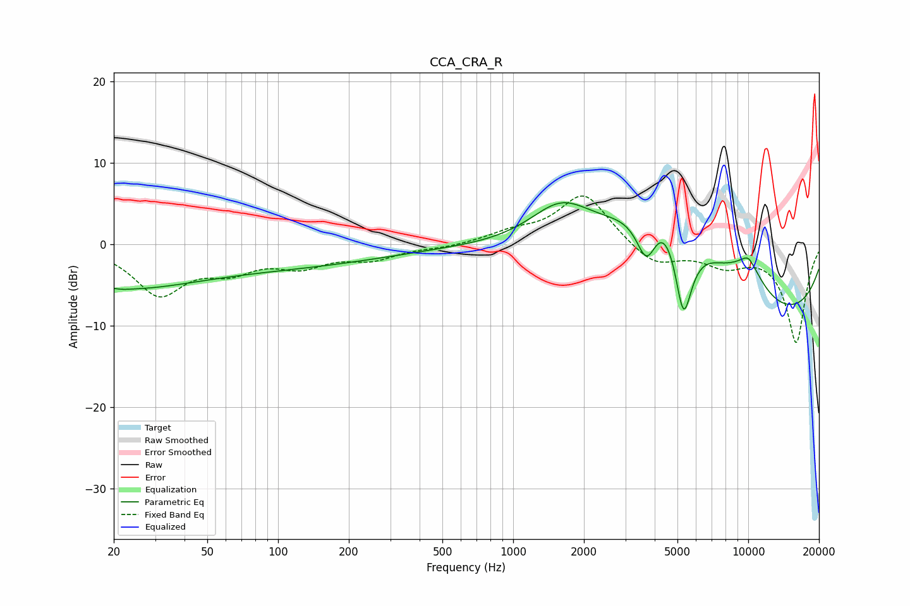

# CCA_CRA_R
See [usage instructions](https://github.com/jaakkopasanen/AutoEq#usage) for more options and info.

### Parametric EQs
Apply preamp of -5.2 dB when using parametric equalizer.

|   # | Type    |   Fc (Hz) |    Q |   Gain (dB) |
|-----|---------|-----------|------|-------------|
|   1 | Peaking |        20 | 0.48 |        -2.9 |
|   2 | Peaking |        22 | 4.71 |        -0.1 |
|   3 | Peaking |        56 | 0.19 |        -3   |
|   4 | Peaking |      1599 | 1.04 |         5.1 |
|   5 | Peaking |      3697 | 2.99 |        -6.7 |
|   6 | Peaking |      4402 | 0.66 |        16.3 |
|   7 | Peaking |      5300 | 3.32 |       -12   |
|   8 | Peaking |      8951 | 0.19 |       -11.1 |
|   9 | Peaking |     10000 | 5.98 |         0.6 |
|  10 | Peaking |     10000 | 1.74 |         3.7 |

### Fixed Band EQs
When using fixed band (also called graphic) equalizer, apply preamp of **-6.0 dB** (if available) and set gains manually with these parameters.

|   # | Type    |   Fc (Hz) |    Q |   Gain (dB) |
|-----|---------|-----------|------|-------------|
|   1 | Peaking |        31 | 1.41 |        -5.9 |
|   2 | Peaking |        62 | 1.41 |        -2.6 |
|   3 | Peaking |       125 | 1.41 |        -2.3 |
|   4 | Peaking |       250 | 1.41 |        -1.6 |
|   5 | Peaking |       500 | 1.41 |        -0.4 |
|   6 | Peaking |      1000 | 1.41 |         1.2 |
|   7 | Peaking |      2000 | 1.41 |         6.3 |
|   8 | Peaking |      4000 | 1.41 |        -2.7 |
|   9 | Peaking |      8000 | 1.41 |        -2.2 |
|  10 | Peaking |     16000 | 1.41 |       -12   |

### Graphs

